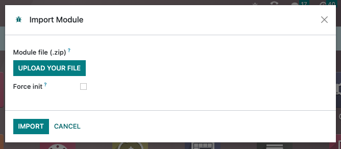

# Going live

Once all the web design and development work finished, it's time to deploy it on a development or
production database.

## Module import

### Odoo SaaS

Follow these steps the first time you import a module:

1. Create a ZIP file of your module.
2. Connect to the project database.
3. Enable the [developer mode](../../../applications/general/developer_mode.md#developer-mode).
4. Go to Apps, search for `base_import_module`, and install it if necessary.
5. Click on Import Module in the menu.
6. Upload your ZIP file, tick Force init, and click the Import App button.

If you need to re-import a module after making some changes, follow the same steps, but before
importing the module, open the developer menu and select Become Superuser. To leave the
Superuser mode, log out and log back in.

#### IMPORTANT
- Don't forget to untick Force init if you import a module for the second time.
  Otherwise, existing data might be lost. ([Related to noupdate=1](pages.md#website-themes-pages-theme-pages-noupdate)).
- The ZIP file size must be less than 50 MB.

#### SEE ALSO
- [Odoo eLearning: Register a Free Domain Name](https://www.odoo.com/slides/slide/register-a-free-domain-name-1663)

### Odoo.sh

Go to Apps and click on Update Apps List in the menu. Search for your module
in the list and install it.

#### SEE ALSO
[Introduction to Odoo.sh](../../../administration/odoo_sh/overview/introduction.md)

## What's next?

After importing and installing the module and before going live, make sure to check the SEO and
redirects as well as your domain name.

#### SEE ALSO
**SEO & Redirects**

- [Search Engine Optimization (SEO)](../../../applications/websites/website/pages/seo.md)
- [URL redirect mapping](../../../applications/websites/website/pages/#website-url-redirection)

**Domain name**

- [Configure an existing domain name](../../../applications/websites/website/configuration/domain_names.md#domain-name-existing)
