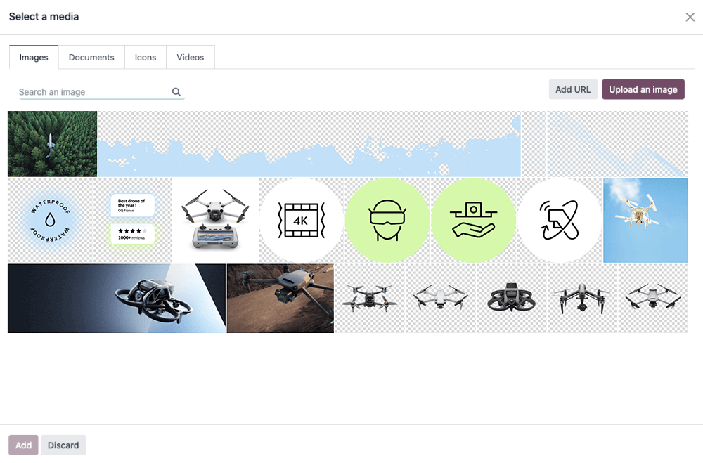

# Media

In this chapter we will see how to include media elements such as images, videos or icons within Odoo.

<a id="website-themes-media-images"></a>

## Images

Record images in the database and use them later in your design/code. They will also be
available for the end user through the *media dialog*.



The Website Builder supports the following image file formats: JPG, GIF, PNG, and SVG.

#### WARNING
Some options offered by the Website Builder are only applicable to media registered into a
record. You might not see some options if you add an image directly with a relative path to
your module folder.

<a id="website-themes-media-images-declaration"></a>

### Declaration

To use your images in your code and have them included in the builder's gallery (so the client can
reuse them), declare them like this:

```xml
<record id="img_about_01" model="ir.attachment">
    <field name="name">About Image 01</field>
    <field name="datas" type="base64" file="website_airproof/static/src/img/content/img_about_01.jpg"/>
    <field name="res_model">ir.ui.view</field>
    <field name="public" eval="True"/>
</record>
```

| Field   | Description                                    |
|---------|------------------------------------------------|
| id      | The name of your image to be used in your code |
| name    | A descriptive name for your image              |
| datas   | The location of your image                     |

<a id="website-themes-media-images-use"></a>

### Use

<a id="website-themes-media-images-use-regular"></a>

#### Regular images

In your xml templates, call your images as follows:

```xml

```

Being `img_about_01` the id you gave to your image.

<a id="website-themes-media-images-use-background"></a>

#### Background images

```xml
<section style="background-image: url('/web/image/website_airproof.img_about_01');">
```

<a id="website-themes-media-images-use-logo"></a>

#### Company logo

For the company logo, the use is a little bit different. First declare it within the `images.xml`
library and then call it using the right template. For instance, to call inside the header, we will
use `<t t-call="website.placeholder_header_brand">`.

```xml
<record id="website.default_website" model="website">
    <field name="logo" type="base64" file="website_airproof/static/src/img/content/logo.png"/>
</record>
```

#### NOTE
[Here](theming.md#theming-module-website) you can find more information about the company logo setup
and global website settings presets.

<a id="website-themes-media-videos"></a>

## Videos

Add videos as background.

```xml
<section class="o_background_video" data-bg-video-src="...">
    <!-- Content -->
</section>
```

| Attribute         | Description   |
|-------------------|---------------|
| data-bg-video-src | Video URL.    |

Add videos as content.

```xml
<div class="media_iframe_video" data-oe-expression="...">
    <div class="css_editable_mode_display">&nbsp;</div>
    <div class="media_iframe_video_size" contenteditable="false">&nbsp;</div>
    <iframe src="..."
        frameborder="0"
        contenteditable="false"
        allowfullscreen="allowfullscreen"/>
</div>
```

| Attribute          | Description   |
|--------------------|---------------|
| data-oe-expression | Video URL.    |
| src                | Video URL.    |

<a id="website-themes-media-icons"></a>

## Icons

By default, the Font Awesome icons library is included in the Website Builder. You can place icons
anywhere using the CSS Prefix `fa` and the icon's name. Font Awesome is designed to be used with
inline elements. You can use `<i>` tag for brevity, but using a `<span>` is more semantically
correct.

```xml
<span class="fa fa-picture-o"/>
```

#### SEE ALSO
[Font Awesome v4 icons](https://fontawesome.com/v4/icons/)

Enable the Website Builder style options.

```xml
<span class="fa fa-2x fa-picture-o rounded-circle"/>
```

Increase the icon size (fa-2x, fa-3x, fa-4x, or fa-5x classes).

```xml
<span class="fa fa-2x fa-picture-o"/>
```


