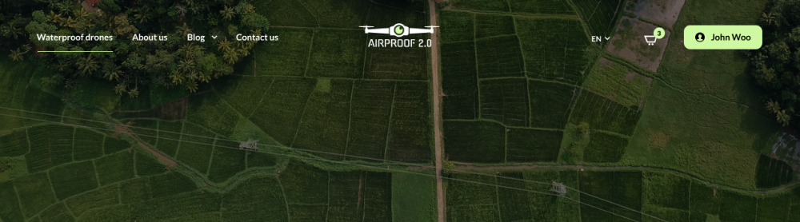
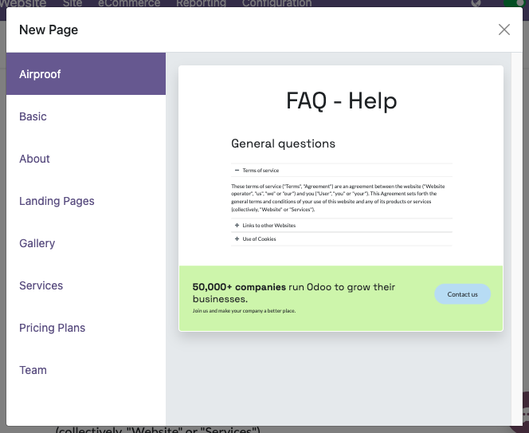

# Pages

In this chapter, you will learn how to declare static pages.

<a id="website-themes-pages-default"></a>

## Default pages

In Odoo, websites come with a few default static pages (Home, Contact us, 404, ...). They are built
the following way.

```xml
<template id="website.homepage" name="Home">
   <t t-call="website.layout">
      <t t-set="pageName" t-value="'homepage'"/>
      <div id="wrap" class="oe_structure oe_empty" />
   </t>
</template>
```

Each default page is a template with its own content saved into a record. This is the reason why,
[custom pages are created within a record](#website-themes-pages-theme-pages).

The `<t -call='website.layout'>` has some variables that can be set:

Define the meta title.

```xml
<t t-set="additional_title">My Page Title</t>
```

Define the meta description.

```xml
<t t-set="meta_description">This is the description of the page that will appear on Search
Engines.</t>
```

Add a CSS class to the page.

```xml
<t t-set="pageName" t-valuef="..."/>
```

Hide the header.

```xml
<t t-set="no_header" t-value="true"/>
```

Hide the footer.

```xml
<t t-set="no_footer" t-value="true"/>
```

If needed, deactivate default pages.

```xml
<record id="website.homepage" model="ir.ui.view">
    <field name="active" eval="False"/>
</record>
```

```xml
<record id="website.contactus" model="ir.ui.view">
    <field name="active" eval="False"/>
</record>
```

Alternatively, replace the default content of these pages using XPath.

```xml
<template id="404" inherit_id="http_routing.404">
    <xpath expr="//*[@id='wrap']" position="replace">
        <t t-set="additional_title" t-value="'404 - Not found'"/>

        <div id="wrap" class="oe_structure">
            <!-- Content -->
        </div>
    </xpath>
</template>
```

#### SEE ALSO
- [Odoo Documentation on SEO](../../../applications/websites/website/pages/seo.md)

<a id="website-themes-pages-theme-pages"></a>

## Theme pages

You can add as many pages as you want to your website. Instead of defining a `<template>`, create a
page object.

**Declaration**

```xml
<odoo>
   <data noupdate="1">
      <record id="page_about_us" model="website.page">
            <field name="name">About us</field>
            <field name="is_published" eval="True"/>
            <field name="key">website_airproof.page_about_us</field>
            <field name="url">/about-us</field>
            <field name="website_id" eval="1" />
            <field name="type">qweb</field>
            <field name="arch" type="xml">
               <t t-name="website_airproof.page_about_us">
                  <t t-call="website.layout">
                     <div id="wrap" class="oe_structure">
                        <!-- Content -->
                     </div>
                  </t>
               </t>
            </field>
      </record>
   </data>
</odoo>
```

| Field        | Description                                            |
|--------------|--------------------------------------------------------|
| name         | Page name (human-readable).                            |
| is_published | Define if the page is published (visible to visitors). |
| key          | View key (must be unique)                              |
| url          | Relative path where the page is reachable.             |
| type         | View type                                              |
| arch         | View architecture (the markup of your page)            |

With `<t t-call="website.layout">` you use the Odoo default page layout with your code.

<a id="website-themes-pages-theme-pages-noupdate"></a>

### `noupdate` attribute

This attribute prevents data overwriting. It can be added either on a `data` tag wrapping some
records to protect or on the `odoo`tag` in order to protect all records declared into the file.

Protect all records of the file:

```xml
<?xml version="1.0" encoding="utf-8"?>
<odoo noupdate="1">
   <record id="menu_company" model="website.menu">
      <!-- Fields -->
   </record>
   <record id="menu_faq" model="website.menu">
      <!-- Fields -->
   </record>
</odoo>
```

Protect specific records in the file:

```xml
<?xml version="1.0" encoding="utf-8"?>
<odoo>
   <record id="menu_company" model="website.menu">
      <!-- Fields -->
   </record>

   <data noupdate="1">
      <record id="menu_faq" model="website.menu">
         <!-- Fields -->
      </record>
      <record id="menu_legal" model="website.menu">
         <!-- Fields -->
      </record>
   </data>
</odoo>
```

**Use case**

There are several static pages created in the module. This one has been installed on the database
and the end-user has updated some of those pages. Some bug fixes must be applied on the
static pages while avoiding any loss of changes made by the end-user.

**Problem**

In case of a module update on the database, every record declared into the module will overwrite
those existing in the database even if the end-user has changed some of these records.

**Solution**

By wrapping the record (or all records declared in the file) into a `<data noupdate="1"></data>`
tag, the record declared is created at the first module installation but not updated after a module
update.

<a id="website-themes-pages-theme-pages-header-overlay"></a>

### Header overlay

Make the header background transparent and stand on top of the page content.

```xml
<field name="header_overlay" eval="True"/>
```



#### NOTE
To create the content of a static page, use the Odoo way of doing things in order to remain
editable by the Website Builder. Please note that Odoo takes advantage of Bootstrap framework (5.1.3).

Find the available classes and components:

- [Bootstrap cheat sheet](https://getbootstrap.com/docs/5.1/examples/cheatsheet/)
- [Bootstrap documentation](https://getbootstrap.com/docs/5.1/getting-started/introduction/)

<a id="website-themes-pages-theme-pages-page-templates"></a>

### Page templates

Create preset static page templates available from the New Page dialog window.

**Declaration**

The page templates has to be defined into the `__manifest__.py` of the module through
`new_page_templates`:

```python
{
   'name': 'Airproof Theme',
   'description': '...',
   'category': 'Website/Theme',
   'version': '17.0.0',
   'author': '...',
   'license': '...',
   'depends': ['website'],
   'data': [
      # ...
   ],
   'assets': {
      # ...
   },
   'new_page_templates': {
      'airproof': {
         'faq': ['s_airproof_text_block_h1', 's_title', 's_faq_collapse', 's_call_to_action']
   }
}
```

**Templates**

Then you have to create the template using a specific naming convention based on the hierarchy into
the `__manifest__.py`. In this case, the name is `new_page_template_sections_airproof_faq`.
The building blocks called in this template are exactly the same as the standard ones except for
the first that has been adapted "on the fly".

Create a new instance of the standard `s_text_block` (`primary` attribute is important) and apply some
adaptations:

```xml
<template id="s_airproof_text_block_h1" inherit_id="website.s_text_block" primary="True">
   <xpath expr="//div[hasclass('container')]|//div[hasclass('o_container_small')]" position="replace">
      <div class="container s_allow_columns">
            <h1 class="display-1">FAQ - Help</h1>
      </div>
   </xpath>
</template>
```

Instantiate each building block (modified or not) for the page template:

```xml
<template id="new_page_template_s_airproof_text_block_h1" inherit_id="website_airproof.s_airproof_text_block_h1" primary="True"/>
<template id="new_page_template_airproof_faq_s_title" inherit_id="website.s_title" primary="True"/>
```

Then, create your page template with some `t-snippet-call` within an '#wrap' as explained above:

```xml
<div id="wrap">
   <t t-snippet-call="website_airproof.new_page_template_airproof_faq_s_text_block_h1"/>
   <t t-snippet-call="website_airproof.new_page_template_airproof_faq_s_title"/>
   <t t-snippet-call="website_airproof.new_page_template_airproof_faq_s_faq_collapse"/>
   <t t-snippet-call="website_airproof.new_page_template_airproof_faq_s_call_to_action"/>
</div>
```

Once the page template is created, it can be added to an existing group. Find below a list of the
existing group:

```xml
<template id="new_page_template_groups">
   <div id="basic">Basic</div>
   <div id="about">About</div>
   <div id="landing">Landing Pages</div>
   <div id="gallery">Gallery</div>
   <div id="services">Services</div>
   <div id="pricing">Pricing Plans</div>
   <div id="team">Team</div>
</template>
```

Feel free to add custom groups to the list:

```xml
<template id="new_pages_template_groups" inherit_id="website.new_pages_template_groups" name="Airproof - New Page Template Groups">
   <xpath expr="//div[@id='custom']" position="after">
      <div id="airproof">Airproof</div>
   </xpath>
</template>
```



#### SEE ALSO
[Go further by altering the building blocks of a custom template](https://github.com/odoo/odoo/blob/339d929e7a01e077fed8a21507cac4c2ff260b42/addons/website/views/new_page_template_templates.xml#L38)
