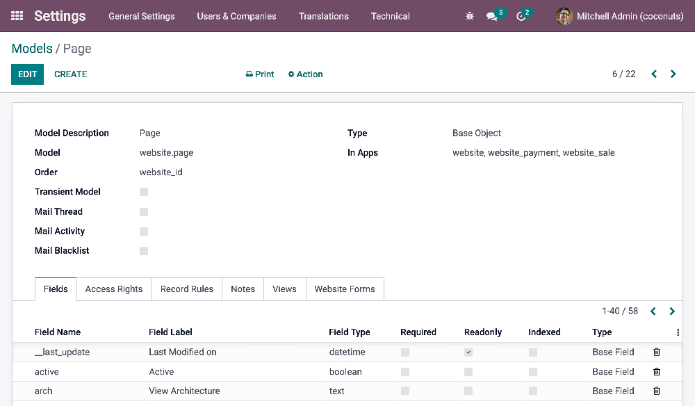
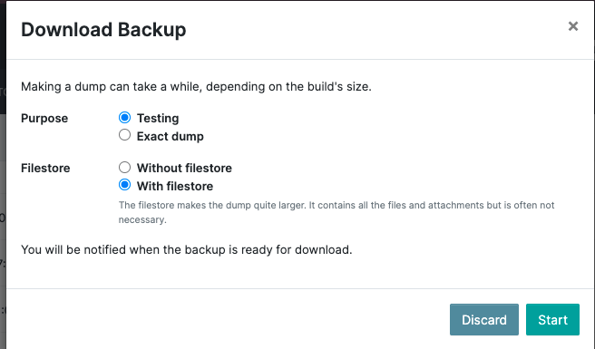
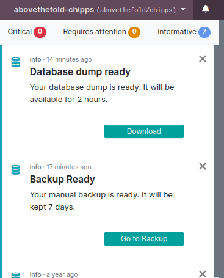

# Setup

In this chapter, you will learn:

- To set up your local development environment.
- The outline of the Odoo database structure.
- To export and import an Odoo database in your local environment.
- To have an Odoo instance up and running.

<a id="website-themes-setup-install"></a>

## Install

There are multiple ways to [install Odoo](../../../administration/on_premise.md), depending on the
intended use case. This documentation assumes you use the [source install](../../../administration/on_premise/source.md) (running Odoo from the source code), which is best suited
for Odoo designers and developers.

<a id="website-themes-setup-databases"></a>

## Databases

<a id="website-themes-setup-databases-structure"></a>

### Structure

Every Odoo application works similarly; they are built with the same logic. A model contains fields
and relational fields that link to other models. Each model has views representing all its fields,
with backend and frontend views.

<a id="website-themes-setup-databases-models"></a>

#### Models

The basis of Odoo is models. Models use fields to record the data. Records are stored in a database:
they are therefore linked to a model. In Odoo, you can find the different models in the
backend by enabling the [developer mode](../../../applications/general/developer_mode.md#developer-mode) and then going to
Settings ‣ Technical ‣ Database Structure: Models.



<a id="website-themes-setup-databases-fields"></a>

#### Fields

In a model, we will centralize fields (field names we need to target in our code).

#### SEE ALSO
[Fields and widgets](../../../applications/studio/fields.md)

<a id="website-themes-setup-databases-fields-classic"></a>

##### Classic fields

- Date
- Char
- Selection
- …

<a id="website-themes-setup-databases-fields-relational"></a>

##### Relational fields

Relational fields call a field from another model. They allow you to link models together and make
them interact easily. In other words, when you use a relational field, you link a record with
another one (located on another model), enabling you to retrieve the content of the fields located
on this linked record.

- **Many2one** fields are filled in by choosing one record from a list of records on another model
  (from *many* records, you select *one*). For example, the *customer* field on a quotation makes
  you choose one customer from a list of several customers on the *contact* model.
- **One2many** fields are reverse searches of existing many2one relations. For example, you could
  list on a contact all their existing quotations (from *one* record, you display *many*).
- **Many2many** fields are filled in by choosing one or several records from a list of records on
  another model. For example, you can put several tags on one product, and several products can use
  the same tags (from *many* records, you can select *many*).

<a id="website-themes-setup-databases-views"></a>

#### Views

Views define how records should be displayed to end-users. They are specified in XML, meaning they
can be edited independently from the models they represent. They are flexible and allow deep
customization of the screens they control.

<a id="website-themes-setup-databases-views-backend-vs-frontend"></a>

##### Backend vs. Frontend

- **Backend views**: Kanban, List, Form, etc.
- **Frontend view**: QWeb

<a id="website-themes-setup-databases-views-static-vs-dynamic"></a>

##### Static vs. Dynamic

- **Static pages** have stable content, such as the homepage. You can define their URL and set some
  properties like published, indexed, etc.
- **Dynamic pages** are dynamically generated, such as the product page. Their URL is dynamic
  and is accessible to all by default (this can be changed by configuring access rights).

<a id="website-themes-setup-databases-views-standard-vs-inherited"></a>

##### Standard vs. Inherited

- **Standard views** are base views implemented by Odoo. They are directly derived from their model.
  You should never change them as they allow updating an Odoo database without overwriting a
  client's modifications.
- **Inherited views** are duplicated views. Modifications always take place in an inherited view. If
  there is a duplicate view, there will be two views with the same name in the database, but the
  duplicated view will not have an ID like for standard view.

<a id="website-themes-setup-databases-import"></a>

### Import an existing database

#### NOTE
You can directly go to the [Theming](theming.md) chapter if you do not need to import an existing
database.

<a id="website-themes-setup-databases-import-dump"></a>

#### Dump

<a id="website-themes-setup-databases-import-saas"></a>

##### Odoo SaaS

Go to `<database_url>/saas_worker/dump`.

<a id="website-themes-setup-databases-import-sh"></a>

##### Odoo.sh

1. Connect to Odoo.sh.
2. Select the branch you want to back up.
3. Choose the BACKUPS tab.
4. Click the Create Backup button.
5. When the process is over, a notification appears. Open it and click the Go to Backup
   button.
6. Click the Download icon. Select Testing under
   Purpose and With filestore under Filestore.
   
7. You will receive a notification when the dump is ready to be downloaded. Open it and click on
   Download to get your dump.
   

<a id="website-themes-setup-databases-import-filestore"></a>

#### Move filestore

Copy all the folders included in the filestore folder and paste them to the following location on
your computer:

- macOS: `/Users/<User>/Library/Application Support/Odoo/filestore/<database_name>`
- Linux: `/home/<User>/.local/share/Odoo/filestore/<database_name>`

#### NOTE
`/Library` is a hidden folder.

<a id="website-themes-setup-databases-import-database-setup"></a>

#### Database setup

Create an empty database.

```bash
createdb <database_name>
```

Import the SQL file in the database that you just created.

```bash
psql <database_name> < dump.sql
```

Reset the admin user password.

```bash
psql \c
<database_name>
update res_users set login='admin', password='admin' where id=2;
```

If necessary, disable the two-factor authentication enforcing policy option.

```bash
psql <database-name>
update res_users set top_secret='' where id=2;
```

<a id="website-themes-setup-getting-started"></a>

## Getting started

<a id="website-themes-setup-getting-started-running-odoo"></a>

### Running Odoo

Once all dependencies are set up, Odoo can be launched by running `odoo-bin`, the command-line
interface of the server. It is located at the root of the Odoo Community directory.

- [Running Odoo](../../../administration/on_premise/source.md#install-source-running-odoo)
- [Docker](https://hub.docker.com/_/odoo/)

To configure the server, you can specify command-line arguments or a configuration file. The first
method is presented below.

The [CLI](../../reference/cli.md#reference-cmdline) offers several functionalities related to Odoo. You can use it to
[run the server](../../reference/cli.md#reference-cmdline-server), scaffold an Odoo theme, populate a database, or
count the number of lines of code.

<a id="website-themes-setup-getting-started-shell-script"></a>

### Shell script

A typical way to [run the server](../../reference/cli.md#reference-cmdline-server) would be to add all command line arguments to a `.sh` script.

| Folder                                                                                                                   | Description                                                                                                                |
|--------------------------------------------------------------------------------------------------------------------------|----------------------------------------------------------------------------------------------------------------------------|
| [`--addons-path`](../../reference/cli.md#cmdoption-odoo-bin-addons-path)                                                 | Comma-separated list of directories in which modules are stored. These directories are<br/>scanned for modules.            |
| [`-d`](../../reference/cli.md#cmdoption-odoo-bin-d)<br/><br/>[`--database`](../../reference/cli.md#cmdoption-odoo-bin-d) | database(s) used when installing or updating modules.                                                                      |
| [`--db-filter`](../../reference/cli.md#cmdoption-odoo-bin-db-filter)                                                     | Hides databases that do not match the filter.                                                                              |
| [`-i`](../../reference/cli.md#cmdoption-odoo-bin-i)<br/><br/>[`--init`](../../reference/cli.md#cmdoption-odoo-bin-i)     | Comma-separated list of modules to install before running the server. (requires `-d`)                                      |
| [`-u`](../../reference/cli.md#cmdoption-odoo-bin-u)<br/><br/>[`--update`](../../reference/cli.md#cmdoption-odoo-bin-u)   | Comma-separated list of modules to update before running the server. (requires `-d`)                                       |
| [`--without-demo`](../../reference/cli.md#cmdoption-odoo-bin-without-demo)                                               | Disables demo data loading for modules installed comma-separated; use `all` for all modules.<br/>(requires `-d` and `-i`)  |
| [`--dev`](../../reference/cli.md#cmdoption-odoo-bin-dev)                                                                 | Comma-separated list of features. For development purposes only. [More info](../../reference/cli.md#reference-cmdline-dev) |

<a id="website-themes-setup-getting-started-signin"></a>

### Sign in

After the server has started (the INFO log `odoo.modules.loading: Modules loaded.` is printed), open
[http://localhost:8069](http://localhost:8069) in your web browser and log in with the base administrator account.

Type **admin** for the email and **admin** for the password.


<a id="website-themes-setup-getting-started-developer-mode"></a>

### Developer mode

The developer mode, also known as debug mode, is useful for development as it gives access to
additional tools. In the next chapters, it is assumed that you have enabled the developer mode.

#### SEE ALSO
[Chế độ lập trình viên (chế độ gỡ lỗi)](../../../applications/general/developer_mode.md)
