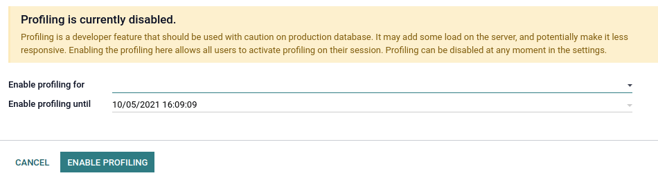
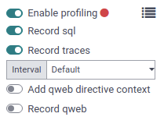
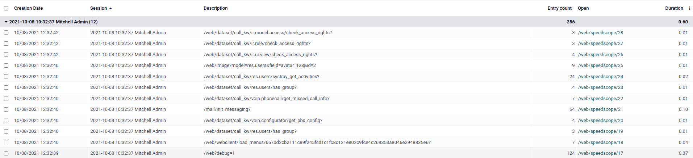
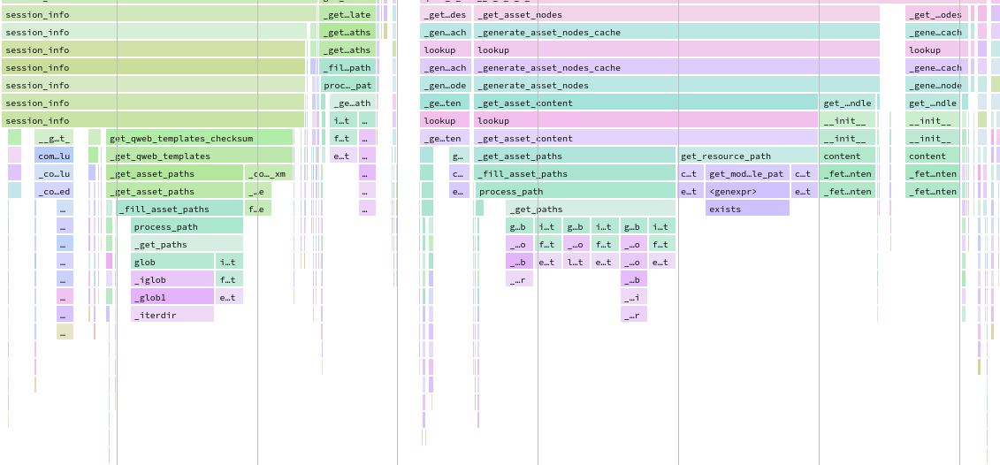
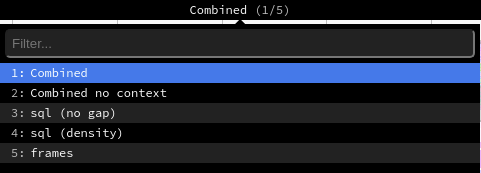

# Performance

<a id="performance-profiling"></a>

## Profiling

Profiling is about analysing the execution of a program and measure aggregated data. These data can
be the elapsed time for each function, the executed SQL queries...

While profiling does not improve the performance of a program by itself, it can prove very helpful
in finding performance issues and identifying which part of the program is responsible for them.

Odoo provides an integrated profiling tool that allows recording all executed queries and stack
traces during execution. It can be used to profile either a set of requests of a user session, or a
specific portion of code. Profiling results can be either inspected with the integrated [speedscope](https://github.com/jlfwong/speedscope) 
view or analyzed with custom tools by first saving them in a JSON file or in the database.

<a id="performance-profiling-enable"></a>

### Enable the profiler

The profiler can either be enabled from the user interface, which is the easiest way to do so but
allows profiling only web requests, or from Python code, which allows profiling any piece of code
including tests.

Enable from the user interface

1. [Enable the developer mode](applications/general/developer_mode.md#developer-mode).
2. Before starting a profiling session, the profiler must be enabled globally on the database.
   This can be done in two ways:
   - Open the [developer mode tools](applications/general/developer_mode.md#developer-mode-tools), then toggle the
     Enable profiling button. A wizard suggests a set of expiry times for the
     profiling. Click on ENABLE PROFILING to enable the profiler globally.
     
   - Go to Settings --> General Settings --> Performance and set the desired time to
     the field Enable profiling until.
3. After the profiler is enabled on the database, users can enable it on their session. To do
   so, toggle the Enable profiling button in the [developer mode tools](applications/general/developer_mode.md#developer-mode-tools) again. By default, the recommended options Record
   sql and Record traces are enabled. To learn more about the different options,
   head over to [Collectors](#performance-profiling-collectors).
   

When the profiler is enabled, all the requests made to the server are profiled and saved into
an `ir.profile` record. Such records are grouped into the current profiling session which
spans from when the profiler was enabled until it is disabled.

#### NOTE
Odoo Online databases cannot be profiled.

Enable from Python code

Starting the profiler manually can be convenient to profile a specific method or a part of the
code. This code can be a test, a compute method, the entire loading, etc.

To start the profiler from Python code, call it as a context manager. You may specify *what*
you want to record through the parameters. A shortcut is available for profiling test classes:
`self.profile()`. See [Collectors](#performance-profiling-collectors) for more information on
the `collectors` parameter.

When the profiler is enabled, all executions of a test method are profiled and saved into an
`ir.profile` record. Such records are grouped into a single profiling session. This is
especially useful when using the `@warmup` and `@users` decorators.

<a id="performance-profiling-analyse"></a>

### Analyse the results

To browse the profiling results, make sure that the [profiler is enabled globally on the
database](#performance-profiling-enable), then open the [developer mode tools](applications/general/developer_mode.md#developer-mode-tools) and click on the button in the top-right corner of the profiling
section. A list view of the `ir.profile` records grouped by profiling session opens.



Each record has a clickable link that opens the speedscope results in a new tab.



Speedscope falls out of the scope of this documentation but there are a lot of tools to try: search,
highlight of similar frames, zoom on frame, timeline, left heavy, sandwich view...

Depending on the profiling options that were activated, Odoo generates different view modes that you
can access from the top menu.


- The Combined view shows all the SQL queries and traces merged togethers.
- The Combined no context view shows the same result but ignores the saved execution
  context <performance/profiling/enable>\`.
- The sql (no gap) view shows all the SQL queries as if they were executed one after
  another, without any Python logic. This is useful for optimizing SQL only.
- The sql (density) view shows only all the SQL queries, leaving gap between them. This
  can be useful to spot if eiter SQL or Python code is the problem, and to identify zones in where
  many small queries could be batched.
- The frames view shows the results of only the [periodic collector](#performance-profiling-collectors-periodic).

#### IMPORTANT
Even though the profiler has been designed to be as light as possible, it can still impact
performance, especially when using the [Sync collector](#performance-profiling-collectors-sync). Keep that in mind when analyzing speedscope results.

<a id="performance-profiling-collectors"></a>

### Collectors

Whereas the profiler is about the *when* of profiling, the collectors take care of the *what*.

Each collector specializes in collecting profiling data in its own format and manner. They can be
individually enabled from the user interface through their dedicated toggle button in the
[developer mode tools](applications/general/developer_mode.md#developer-mode-tools), or from Python code through their key or
class.

There are currently four collectors available in Odoo:

| Name                                                             | Toggle button   | Python key     | Python class        |
|------------------------------------------------------------------|-----------------|----------------|---------------------|
| [SQL collector](#performance-profiling-collectors-sql)           | Record sql      | `sql`          | `SqlCollector`      |
| [Periodic collector](#performance-profiling-collectors-periodic) | Record traces   | `traces_async` | `PeriodicCollector` |
| [QWeb collector](#performance-profiling-collectors-qweb)         | Record qweb     | `qweb`         | `QwebCollector`     |
| [Sync collector](#performance-profiling-collectors-sync)         | No              | `traces_sync`  | `SyncCollector`     |

By default, the profiler enables the SQL and the Periodic collectors. Both when it is enabled from
the user interface or Python code.

<a id="performance-profiling-collectors-sql"></a>

#### SQL collector

The SQL collector saves all the SQL queries made to the database in the current thread (for all
cursors), as well as the stack trace. The overhead of the collector is added to the analysed thread
for each query, which means that using it on a lot of small queries may impact execution time and
other profilers.

It is especially useful to debug query counts, or to add information to the [Periodic collector](#performance-profiling-collectors-periodic) in the combined speedscope view.

<a id="performance-profiling-collectors-periodic"></a>

#### Periodic collector

This collector runs in a separate thread and saves the stack trace of the analysed thread at every
interval. The interval (by default 10 ms) can be defined through the Interval option in
the user interface, or the `interval` parameter in Python code.

#### WARNING
If the interval is set at a very low value, profiling long requests will generate memory issues.
If the interval is set at a very high value, information on short function executions will be
lost.

It is one of the best way to analyse performance as it should have a very low impact on the
execution time thanks to its separate thread.

<a id="performance-profiling-collectors-qweb"></a>

#### QWeb collector

This collector saves the Python execution time and queries of all directives. As for the [SQL
collector](#performance-profiling-collectors-sql), the overhead can be important when executing a
lot of small directives. The results are different from other collectors in terms of collected data,
and can be analysed from the `ir.profile` form view using a custom widget.

It is mainly useful for optimizing views.

<a id="performance-profiling-collectors-sync"></a>

#### Sync collector

This collector saves the stack for every function's call and return and runs on the same thread,
which greatly impacts performance.

It can be useful to debug and understand complex flows, and follow their execution in the code. It
is however not recommended for performance analysis because the overhead is high.

<a id="performance-profiling-pitfalls"></a>

### Performance pitfalls

- Be careful with randomness. Multiple executions may lead to different results. E.g., a garbage
  collector being triggered during execution.
- Be careful with blocking calls. In some cases, external `c_call` may take some time before
  releasing the GIL, thus leading to unexpected long frames with the [Periodic collector](#performance-profiling-collectors-periodic). This should be detected by the profiler and give a
  warning. It is possible to trigger the profiler manually before such calls if needed.
- Pay attention to the cache. Profiling before that the `view`/`assets`/... are in cache can lead to
  different results.
- Be aware of the profiler's overhead. The [SQL collector](#performance-profiling-collectors-sql)'s overhead can be important when a lot of small queries
  are executed. Profiling is practical to spot a problem but you may want to disable the profiler in
  order to measure the real impact of a code change.
- Profiling results can be memory intensive. In some cases (e.g., profiling an install or a long
  request), it is possible that you reach memory limit, especially when rendering the speedscope
  results, which can lead to an HTTP 500 error. In this case, you may need to start the server with
  a higher memory limit: `--limit-memory-hard $((8*1024**3))`.

<a id="reference-performance-populate"></a>

## Database population

Odoo CLI offers a [database population](developer/reference/cli.md#reference-cmdline-populate) feature through the CLI
command **odoo-bin populate**.

Instead of the tedious manual, or programmatic, specification of test data, one can use this feature
to fill a database on demand with the desired number of test data. This can be used to detect
diverse bugs or performance issues in tested flows.

<a id="reference-performance-populate-methods"></a>

To populate a given model, the following methods and attributes can be defined.

#### NOTE
You have to define at least `_populate()` or
`_populate_factories()` on the model to enable database population.

### Population tools

Multiple population tools are available to easily create the needed data generators.

<a id="performance-good-practices"></a>

## Good practices

<a id="performance-good-practices-batch"></a>

### Batch operations

When working with recordsets, it is almost always better to batch operations.

<a id="performance-good-practices-algorithmic-complexity"></a>

### Reduce the algorithmic complexity

Algorithmic complexity is a measure of how long an algorithm would take to complete in regard to the
size `n` of the input. When the complexity is high, the execution time can grow quickly as the input
becomes larger. In some cases, the algorithmic complexity can be reduced by preparing the input's
data correctly.

<a id="performance-good-practices-index"></a>

### Use indexes

Database indexes can help fasten search operations, be it from a search in the or through the user
interface.

```python
name = fields.Char(string="Name", index=True)
```

#### WARNING
Be careful not to index every field as indexes consume space and impact on performance when
executing one of `INSERT`, `UPDATE`, and `DELETE`.
