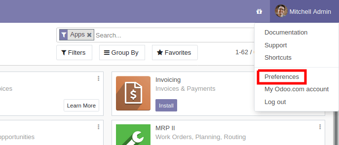
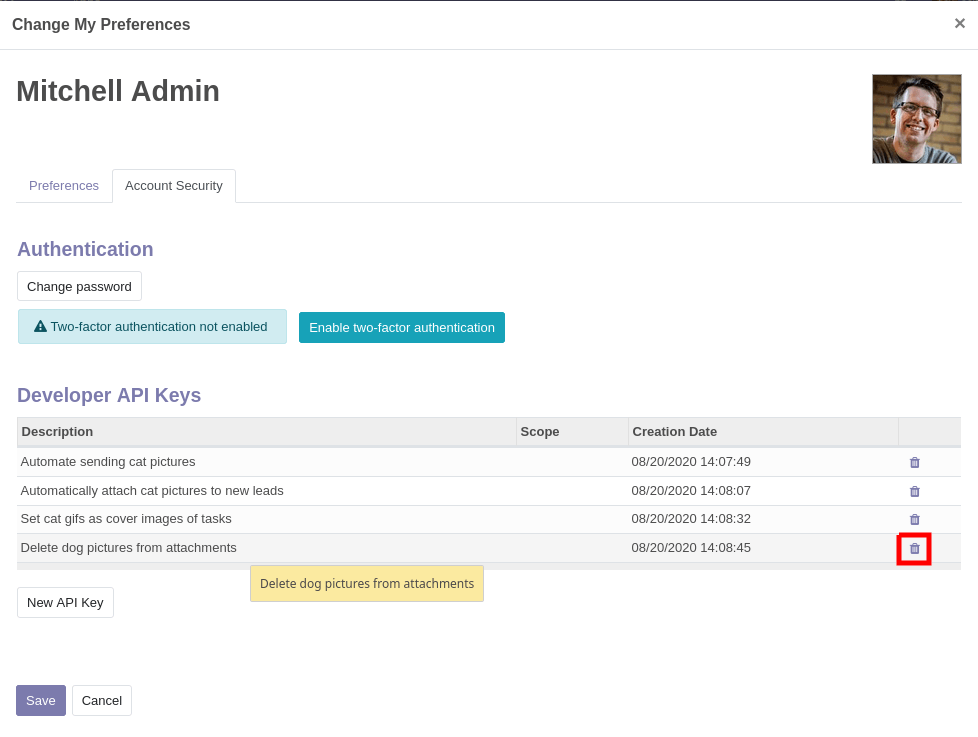

# External API

Odoo is usually extended internally via modules, but many of its features and
all of its data are also available from the outside for external analysis or
integration with various tools. Part of the [Models](developer/reference/backend/orm.md#reference-orm-model) API is
easily available over [XML-RPC](https://en.wikipedia.org/wiki/XML-RPC) and accessible from a variety of languages.

#### IMPORTANT
Starting with PHP8, the XML-RPC extension may not be available by default.
Check out the [manual](https://www.php.net/manual/en/xmlrpc.installation.php)
for the installation steps.

#### NOTE
Access to data via the external API is only available on *Custom* Odoo pricing plans. Access to
the external API is not available on *One App Free* or *Standard* plans. For more information
visit the [Odoo pricing page](https://www.odoo.com/pricing-plan) or reach out to your Customer
Success Manager.

#### SEE ALSO
- [Tutorial on web services](developer/howtos/web_services.md)

## Connection

### Configuration

If you already have an Odoo server installed, you can just use its parameters.

#### IMPORTANT
For Odoo Online instances (<domain>.odoo.com), users are created without a
*local* password (as a person you are logged in via the Odoo Online
authentication system, not by the instance itself). To use XML-RPC on Odoo
Online instances, you will need to set a password on the user account you
want to use:

* Log in your instance with an administrator account.
* Go to Settings ‣ Users & Companies ‣ Users.
* Click on the user you want to use for XML-RPC access.
* Click on Action and select Change Password.
* Set a New Password value then click Change Password.

The *server url* is the instance's domain (e.g.
*https://mycompany.odoo.com*), the *database name* is the name of the
instance (e.g. *mycompany*). The *username* is the configured user's login
as shown by the *Change Password* screen.

Python

```python
url = <insert server URL>
db = <insert database name>
username = 'admin'
password = <insert password for your admin user (default: admin)>
```

Ruby

```ruby
url = <insert server URL>
db = <insert database name>
username = "admin"
password = <insert password for your admin user (default: admin)>
```

PHP

```php
$url = <insert server URL>;
$db = <insert database name>;
$username = "admin";
$password = <insert password for your admin user (default: admin)>;
```

Java

```java
final String url = <insert server URL>,
              db = <insert database name>,
        username = "admin",
        password = <insert password for your admin user (default: admin)>;
```

Go

```go
var (
    url = <insert server URL>
    db = <insert database name>
    username = "admin"
    password = <insert password for your admin user (default: admin)>
)
```

<a id="api-external-api-keys"></a>

#### API Keys

#### Versionadded
Added in version 14.0.

Odoo has support for **api keys** and (depending on modules or settings) may
**require** these keys to perform webservice operations.

The way to use API Keys in your scripts is to simply replace your **password**
by the key. The login remains in-use. You should store the API Key as carefully
as the password as they essentially provide the same access to your user
account (although they can not be used to log-in via the interface).

In order to add a key to your account, simply go to your
Preferences (or My Profile):



then open the Account Security tab, and click
New API Key:


Input a description for the key, **this description should be as clear and
complete as possible**: it is the only way you will have to identify your keys
later and know whether you should remove them or keep them around.

Click Generate Key, then copy the key provided. **Store this key
carefully**: it is equivalent to your password, and just like your password
the system will not be able to retrieve or show the key again later on. If you lose
this key, you will have to create a new one (and probably delete the one you
lost).

Once you have keys configured on your account, they will appear above the
New API Key button, and you will be able to delete them:



**A deleted API key can not be undeleted or re-set**. You will have to generate
a new key and update all the places where you used the old one.

#### Test database

To make exploration simpler, you can also ask [https://demo.odoo.com](https://demo.odoo.com) for a test
database:

Python

```python
import xmlrpc.client
info = xmlrpc.client.ServerProxy('https://demo.odoo.com/start').start()
url, db, username, password = info['host'], info['database'], info['user'], info['password']
```

Ruby

```ruby
require "xmlrpc/client"
info = XMLRPC::Client.new2('https://demo.odoo.com/start').call('start')
url, db, username, password = info['host'], info['database'], info['user'], info['password']
```

PHP

```php
require_once('ripcord.php');
$info = ripcord::client('https://demo.odoo.com/start')->start();
list($url, $db, $username, $password) = array($info['host'], $info['database'], $info['user'], $info['password']);
```

#### NOTE
These examples use the [Ripcord](https://code.google.com/p/ripcord/)
library, which provides a simple XML-RPC API. Ripcord requires that
[XML-RPC support be enabled](https://php.net/manual/en/xmlrpc.installation.php) in your PHP
installation.

Since calls are performed over
[HTTPS](https://en.wikipedia.org/wiki/HTTP_Secure), it also requires that
the [OpenSSL extension](https://php.net/manual/en/openssl.installation.php) be enabled.

Java

```java
final XmlRpcClient client = new XmlRpcClient();

final XmlRpcClientConfigImpl start_config = new XmlRpcClientConfigImpl();
start_config.setServerURL(new URL("https://demo.odoo.com/start"));
final Map<String, String> info = (Map<String, String>)client.execute(
    start_config, "start", emptyList());

final String url = info.get("host"),
              db = info.get("database"),
        username = info.get("user"),
        password = info.get("password");
```

#### NOTE
These examples use the [Apache XML-RPC library](https://ws.apache.org/xmlrpc/).

The examples do not include imports as these imports couldn't be
pasted in the code.

Go

```go
client, err := xmlrpc.NewClient("https://demo.odoo.com/start", nil)
if err != nil {
    log.Fatal(err)
}
info := map[string]string{}
client.Call("start", nil, &info)
url = info["host"].(string)
db = info["database"].(string)
username = info["user"].(string)
password = info["password"].(string)
```

#### NOTE
These examples use the [github.com/kolo/xmlrpc library](https://github.com/kolo/xmlrpc).

The examples do not include imports as these imports couldn't be
pasted in the code.

### Logging in

Odoo requires users of the API to be authenticated before they can query most
data.

The `xmlrpc/2/common` endpoint provides meta-calls which don't require
authentication, such as the authentication itself or fetching version
information. To verify if the connection information is correct before trying
to authenticate, the simplest call is to ask for the server's version. The
authentication itself is done through the `authenticate` function and
returns a user identifier (`uid`) used in authenticated calls instead of
the login.

Python

```python
common = xmlrpc.client.ServerProxy('{}/xmlrpc/2/common'.format(url))
common.version()
```

Ruby

```ruby
common = XMLRPC::Client.new2("#{url}/xmlrpc/2/common")
common.call('version')
```

PHP

```php
$common = ripcord::client("$url/xmlrpc/2/common");
$common->version();
```

Java

```java
final XmlRpcClientConfigImpl common_config = new XmlRpcClientConfigImpl();
common_config.setServerURL(new URL(String.format("%s/xmlrpc/2/common", url)));
client.execute(common_config, "version", emptyList());
```

Go

```go
client, err := xmlrpc.NewClient(fmt.Sprintf("%s/xmlrpc/2/common", url), nil)
if err != nil {
    log.Fatal(err)
}
common := map[string]any{}
if err := client.Call("version", nil, &common); err != nil {
    log.Fatal(err)
}
```

Result:

```json
{
    "server_version": "13.0",
    "server_version_info": [13, 0, 0, "final", 0],
    "server_serie": "13.0",
    "protocol_version": 1,
}
```

Python

```python
uid = common.authenticate(db, username, password, {})
```

Ruby

```ruby
uid = common.call('authenticate', db, username, password, {})
```

PHP

```php
$uid = $common->authenticate($db, $username, $password, array());
```

Java

```java
int uid = (int)client.execute(common_config, "authenticate", asList(db, username, password, emptyMap()));
```

Go

```go
var uid int64
if err := client.Call("authenticate", []any{
    db, username, password,
    map[string]any{},
}, &uid); err != nil {
    log.Fatal(err)
}
```

<a id="api-external-api-calling-methods"></a>

## Calling methods

The second endpoint is `xmlrpc/2/object`. It is used to call methods of odoo
models via the `execute_kw` RPC function.

Each call to `execute_kw` takes the following parameters:

* the database to use, a string
* the user id (retrieved through `authenticate`), an integer
* the user's password, a string
* the model name, a string
* the method name, a string
* an array/list of parameters passed by position
* a mapping/dict of parameters to pass by keyword (optional)

### List records

Records can be listed and filtered via `search()`.

`search()` takes a mandatory
[domain](developer/reference/backend/orm.md#reference-orm-domains) filter (possibly empty), and returns the
database identifiers of all records matching the filter.

#### Pagination

By default a search will return the ids of all records matching the
condition, which may be a huge number. `offset` and `limit` parameters are
available to only retrieve a subset of all matched records.

### Count records

Rather than retrieve a possibly gigantic list of records and count them,
`search_count()` can be used to retrieve
only the number of records matching the query. It takes the same
[domain](developer/reference/backend/orm.md#reference-orm-domains) filter as
`search()` and no other parameter.

#### NOTE
Calling `search` then `search_count` (or the other way around) may not
yield coherent results if other users are using the server: stored data
could have changed between the calls.

### Read records

Record data are accessible via the `read()` method,
which takes a list of ids (as returned by
`search()`), and optionally a list of fields to
fetch. By default, it fetches all the fields the current user can read,
which tends to be a huge amount.

#### NOTE
Even if the `id` field is not requested, it is always returned.

### List record fields

`fields_get()` can be used to inspect
a model's fields and check which ones seem to be of interest.

Because it returns a large amount of meta-information (it is also used by client
programs) it should be filtered before printing, the most interesting items
for a human user are `string` (the field's label), `help` (a help text if
available) and `type` (to know which values to expect, or to send when
updating a record).

### Search and read

Because it is a very common task, Odoo provides a
`search_read()` shortcut which, as its name suggests, is
equivalent to a `search()` followed by a
`read()`, but avoids having to perform two requests
and keep ids around.

Its arguments are similar to `search()`'s, but it
can also take a list of `fields` (like `read()`,
if that list is not provided it will fetch all fields of matched records).

### Create records

Records of a model are created using `create()`. The
method creates a single record and returns its database identifier.

`create()` takes a mapping of fields to values, used
to initialize the record. For any field which has a default value and is not
set through the mapping argument, the default value will be used.

#### WARNING
While most value types are what would expect (integer for
`Integer`, string for `Char`
or `Text`),

- `Date`, `Datetime` and
  `Binary` fields use string values
- `One2many` and `Many2many`
  use a special command protocol detailed in `the documentation to
  the write method`.

### Update records

Records can be updated using `write()`. It takes
a list of records to update and a mapping of updated fields to values similar
to `create()`.

Multiple records can be updated simultaneously, but they will all get the same
values for the fields being set. It is not possible to perform
"computed" updates (where the value being set depends on an existing value of
a record).

### Delete records

Records can be deleted in bulk by providing their ids to
`unlink()`.

### Inspection and introspection

While we previously used `fields_get()` to query a
model and have been using an arbitrary model from the start, Odoo stores
most model metadata inside a few meta-models which allow both querying the
system and altering models and fields (with some limitations) on the fly over
XML-RPC.

<a id="reference-webservice-inspection-models"></a>

#### `ir.model`

Provides information about Odoo models via its various fields.

`name`
: a human-readable description of the model

`model`
: the name of each model in the system

`state`
: whether the model was generated in Python code (`base`) or by creating
  an `ir.model` record (`manual`)

`field_id`
: list of the model's fields through a `One2many` to
  [ir.model.fields](#reference-webservice-inspection-fields)

`view_ids`
: `One2many` to the [View architectures](developer/reference/user_interface/view_architectures.md)
  defined for the model

`access_ids`
: `One2many` relation to the
  [Access Rights](developer/reference/backend/security.md#reference-security-acl) set on the model

`ir.model` can be used to

- Query the system for installed models (as a precondition to operations
  on the model or to explore the system's content).
- Get information about a specific model (generally by listing the fields
  associated with it).
- Create new models dynamically over RPC.

#### IMPORTANT
* Custom model names must start with `x_`.
* The `state` must be provided and set to `manual`, otherwise the model will
  not be loaded.
* It is not possible to add new *methods* to a custom model, only fields.

<a id="reference-webservice-inspection-fields"></a>

#### `ir.model.fields`

Provides information about the fields of Odoo models and allows adding
custom fields without using Python code.

`model_id`
: `Many2one` to
  [ir.model](#reference-webservice-inspection-models) to which the field belongs

`name`
: the field's technical name (used in `read` or `write`)

`field_description`
: the field's user-readable label (e.g. `string` in `fields_get`)

`ttype`
: the [type](developer/reference/backend/orm.md#reference-orm-fields) of field to create

`state`
: whether the field was created via Python code (`base`) or via
  `ir.model.fields` (`manual`)

`required`, `readonly`, `translate`
: enables the corresponding flag on the field

`groups`
: [field-level access control](developer/reference/backend/security.md#reference-security-fields), a
  `Many2many` to `res.groups`

`selection`, `size`, `on_delete`, `relation`, `relation_field`, `domain`
: type-specific properties and customizations, see [the fields
  documentation](developer/reference/backend/orm.md#reference-orm-fields) for details

#### IMPORTANT
- Like custom models, only new fields created with `state="manual"` are activated as actual
  fields on the model.
- Computed fields can not be added via `ir.model.fields`, some field meta-information
  (defaults, onchange) can not be set either.
