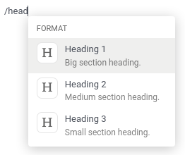

# Odoo Editor

Odoo Editor is Odoo's own rich text editor. Its sources can be found in the
[odoo-editor directory](https://github.com/odoo/odoo/blob/17.0/addons/web_editor/static/src/js/editor/odoo-editor).

## Powerbox

The Powerbox is a piece of user interface that contains
[commands](#reference-frontend-odoo-editor-powerbox-command) organized
into [categories](#reference-frontend-odoo-editor-powerbox-category). It
appears when typing `/` in the editor. The commands can be filtered when the
user inputs text, and navigated with the arrow keys.

### Modifying the Powerbox

Only one Powerbox should be instantiated at the time, and that job is done by
the editor itself. Its Powerbox instance can be found in its `powerbox` instance
variable.
To change the Powerbox's contents and options, change the options passed to the
editor before it gets instantiated.

#### IMPORTANT
Never instantiate the Powerbox yourself. Always use the current editor's own
instance instead.

### Opening a custom Powerbox

It is possible to open the Powerbox with a custom set of categories and
commands, bypassing all pre-existing ones. To do that, call the `open` method of
the Powerbox and pass it your custom commands and categories.

### Filtering commands

There are three ways to filter commands:

1. Via the `powerboxFilters`
   [Powerbox option](#reference-frontend-odoo-editor-powerbox-options).
2. Via a given
   [command](#reference-frontend-odoo-editor-powerbox-command)'s
   `isDisabled` entry.
3. The user can filter commands by simply typing text after opening the
   Powerbox. It will fuzzy-match that text with the names of the categories and
   commands.

### Reference

#### Category

| Name       | Type     | Description                                                                                                                                                                |
|------------|----------|----------------------------------------------------------------------------------------------------------------------------------------------------------------------------|
| `name`     | `string` | the name of the category                                                                                                                                                   |
| `priority` | `number` | used to order the category: a category with a higher priority is displayed higher into the Powerbox (categories with the same priority are ordered alphabetically) |

#### NOTE
If several categories exist with the same name, they will be grouped into
one. Its priority will be that defined in the version of the category that
was declared last.

#### Command

| Name                    | Type                      | Description                                                                                                                                                            |
|-------------------------|---------------------------|------------------------------------------------------------------------------------------------------------------------------------------------------------------------|
| `name`                  | `string`                  | the name of the command                                                                                                                                                |
| `category`              | `string`                  | the name of the category the command belongs to                                                                                                                        |
| `description`           | `string`                  | a short text to describe the command                                                                                                                                   |
| `fontawesome`           | `string`                  | the name of a *Font Awesome* that will serve as the command's icon                                                                                                     |
| `priority`              | `number`                  | used to order the command: a command with a higher priority is displayed higher into the Powerbox (commands with the same priority are ordered alphabetically) |
| `callback`              | `function` (`() => void`) | the function to execute when the command is picked (can be asynchronous)                                                                                               |
| `isDisabled` (optional) | `function` (`() => void`) | a function used to disable the command under certain conditions (when it returns `true`, the command will be disabled)                                             |

#### NOTE
If the command points to a category that doesn't exist yet, that category
will be created and appended at the end of the Powerbox.

#### Options

The following options can be passed to OdooEditor, that will then be passed to
the instance of the Powerbox:

| Name                       | Type                                          | Description                                                                                                            |
|----------------------------|-----------------------------------------------|------------------------------------------------------------------------------------------------------------------------|
| `commands`                 | `array of commands`                           | commands to add to the default defined by the editor                                                                   |
| `categories`               | `array of categories`                         | categories to add to the default defined by the editor                                                                 |
| `powerboxFilters`          | `array of functions` (`commands => commands`) | functions used to filter commands displayed in the Powerbox                                                            |
| `getContextFromParentRect` | `function` (`() => DOMRect`)                  | a function that returns the `DOMRect` of an ancestor of the editor (can be useful when the editor is in an iframe) |
