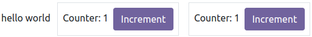

# Chapter 1: Owl components

This chapter introduces the [Owl framework](https://github.com/odoo/owl), a tailor-made component
system for Odoo. The main building blocks of OWL are [components](https://github.com/odoo/owl/blob/master/doc/reference/component.md) and [templates](https://github.com/odoo/owl/blob/master/doc/reference/templates.md).

In Owl, every part of user interface is managed by a component: they hold the logic and define the
templates that are used to render the user interface. In practice, a component is represented by a
small JavaScript class subclassing the `Component` class.

To get started, you need a running Odoo server and a development environment setup. Before getting
into the exercises, make sure you have followed all the steps described in this
[tutorial introduction](../discover_js_framework.md#tutorials-discover-js-framework-setup).

In this chapter, we use the `awesome_owl` addon, which provides a simplified environment that
only contains Owl and a few other files. The goal is to learn Owl itself, without relying on Odoo
web client code.

## Example: a `Counter` component

First, let us have a look at a simple example. The `Counter` component shown below is a component
that maintains an internal number value, displays it, and updates it whenever the user clicks on the
button.

```js
/** @odoo-module **/

import { Component, useState } from "@odoo/owl";

export class Counter extends Component {
    static template = "my_module.Counter";

    setup() {
        this.state = useState({ value: 0 });
    }

    increment() {
        this.state.value++;
    }
}
```

The `Counter` component specifies the name of a template that represents its html. It is written in XML
using the QWeb language:

```xml
<templates xml:space="preserve">
   <t t-name="my_module.Counter">
      <p>Counter: <t t-esc="state.value"/></p>
      <button class="btn btn-primary" t-on-click="increment">Increment</button>
   </t>
</templates>
```

## 1. Displaying a counter


As a first exercise, let us modify the `Playground` component located in
`awesome_owl/static/src/` to turn it into a counter. To see the result, you can go to the
`/awesome_owl` route with your browser.

1. Modify `playground.js` so that it acts as a counter like in the example above.
   Keep `Playground` for the class name. You will need to use the [useState hook](https://github.com/odoo/owl/blob/master/doc/reference/hooks.md#usestate) so that the component is re-rendered
   whenever any part of the state object that has been read by this component is modified.
2. In the same component, create an `increment` method.
3. Modify the template in `playground.xml` so that it displays your counter variable. Use
   [t-esc](https://github.com/odoo/owl/blob/master/doc/reference/templates.md#outputting-data) to output the data.
4. Add a button in the template and specify a [t-on-click](https://github.com/odoo/owl/blob/master/doc/reference/event_handling.md#event-handling) attribute in the button to
   trigger the `increment` method whenever the button is clicked.

#### IMPORTANT
Don't forget `/** @odoo-module **/` in your JavaScript files. More information on this can
be found [here](../../reference/frontend/javascript_modules.md#frontend-modules-native-js).

This exercise showcases an important feature of Owl: the [reactivity system](https://github.com/odoo/owl/blob/master/doc/reference/reactivity.md).
The `useState` function wraps a value in a proxy so Owl can keep track of which component
needs which part of the state, so it can be updated whenever a value has been changed. Try
removing the `useState` function and see what happens.

## 2. Extract `Counter` in a sub component

For now we have the logic of a counter in the `Playground` component, but it is not reusable. Let us
see how to create a [sub-component](https://github.com/odoo/owl/blob/master/doc/reference/component.md#sub-components) from it:

1. Extract the counter code from the `Playground` component into a new `Counter` component.
2. You can do it in the same file first, but once it's done, update your code to move the
   `Counter` in its own folder and file. Import it relatively from `./counter/counter`. Make sure
   the template is in its own file, with the same name.
3. Use `<Counter/>` in the template of the `Playground` component to add two counters in your
   playground.



<a id="tutorials-discover-js-framework-simple-card"></a>

## 3. A simple `Card` component

Components are really the most natural way to divide a complicated user interface into multiple
reusable pieces. But to make them truly useful, it is necessary to be able to communicate
some information between them. Let us see how a parent component can provide information to a
sub component by using attributes (most commonly known as [props](https://github.com/odoo/owl/blob/master/doc/reference/props.md)).

The goal of this exercise is to create a `Card` component, that takes two props: `title` and `content`.
For example, here is how it could be used:

```xml
<Card title="'my title'" content="'some content'"/>
```

The above example should produce some html using bootstrap that look like this:

```html
<div class="card d-inline-block m-2" style="width: 18rem;">
    <div class="card-body">
        <h5 class="card-title">my title</h5>
        <p class="card-text">
         some content
        </p>
    </div>
</div>
```

1. Create a `Card` component
2. Import it in `Playground` and display a few cards in its template


## 4. Using `markup` to display html

If you used `t-esc` in the previous exercise, then you may have noticed that Owl automatically escapes
its content. For example, if you try to display some html like this: `<Card title="'my title'" content="this.html"/>`
with `this.html = "<div>some content</div>""`,
the resulting output will simply display the html as a string.

In this case, since the `Card` component may be used to display any kind of content, it makes sense
to allow the user to display some html. This is done with the
[t-out directive](https://github.com/odoo/owl/blob/master/doc/reference/templates.md#outputting-data).

However, displaying arbitrary content as html is dangerous, it could be used to inject malicious code, so
by default, Owl will always escape a string unless it has been explicitely marked as safe with the `markup`
function.

1. Update `Card` to use `t-out`
2. Update `Playground` to import `markup`, and use it on some html values
3. Make sure that you see that normal strings are always escaped, unlike markuped strings.

#### NOTE
The `t-esc` directive can still be used in Owl templates. It is slightly faster than `t-out`.


## 5. Props validation

The `Card` component has an implicit API. It expects to receive two strings in its props: the `title`
and the `content`. Let us make that API more
explicit. We can add a props definition that will let Owl perform a validation step in [dev mode](https://github.com/odoo/owl/blob/master/doc/reference/app.md#dev-mode). You can activate the dev mode in the [App
configuration](https://github.com/odoo/owl/blob/master/doc/reference/app.md#configuration) (but it is activated by default
on the `awesome_owl` playground).

It is a good practice to do props validation for every component.

1. Add [props validation](https://github.com/odoo/owl/blob/master/doc/reference/props.md#props-validation) to the `Card`
   component.
2. Rename the `title` props into something else in the playground template, then check in the
   Console tab of your browser's dev tools that you can see an error.

## 6. The sum of two `Counter`

We saw in a previous exercise that `props` can be used to provide information from a parent
to a child component. Now, let us see how we can communicate information in the opposite
direction: in this exercise, we want to display two `Counter` components, and below them, the sum of
their values. So, the parent component (`Playground`) need to be informed whenever one of
the `Counter` value is changed.

This can be done by using a [callback prop](https://github.com/odoo/owl/blob/master/doc/reference/props.md#binding-function-props):
a prop that is a function meant to be called back. The child component can choose to call
that function with any argument. In our case, we will simply add an optional `onChange` prop that will
be called whenever the `Counter` component is incremented.

1. Add prop validation to the `Counter` component: it should accept an optional `onChange`
   function prop.
2. Update the `Counter` component to call the `onChange` prop (if it exists) whenever it
   is incremented.
3. Modify the `Playground` component to maintain a local state value (`sum`), initially
   set to 2, and display it in its template
4. Implement an `incrementSum` method in `Playground`
5. Give that method as a prop to two (or more!) sub `Counter` components.


#### IMPORTANT
There is a subtlety with callback props: they usually should be defined with the `.bind`
suffix. See the [documentation](https://github.com/odoo/owl/blob/master/doc/reference/props.md#binding-function-props).

## 7. A todo list

Let us now discover various features of Owl by creating a todo list.  We need two components: a
`TodoList` component that will display a list of `TodoItem` components. The list of todos is a
state that should be maintained by the `TodoList`.

For this tutorial, a `todo` is an object that contains three values: an `id` (number), a `description`
(string) and a flag `isCompleted` (boolean):

```js
{ id: 3, description: "buy milk", isCompleted: false }
```

1. Create a `TodoList` and a `TodoItem` components.
2. The `TodoItem` component should receive a `todo` as a prop, and display its `id` and `description` in a `div`.
3. For now, hardcode the list of todos:
   ```js
   // in TodoList
   this.todos = useState([{ id: 3, description: "buy milk", isCompleted: false }]);
   ```
4. Use [t-foreach](https://github.com/odoo/owl/blob/master/doc/reference/templates.md#loops) to display each todo in a `TodoItem`.
5. Display a `TodoList` in the playground.
6. Add props validation to `TodoItem`.


#### NOTE
The `t-foreach` directive is not exactly the same in Owl as the QWeb python implementation: it
requires a `t-key` unique value, so that Owl can properly reconcile each element.

## 8. Use dynamic attributes

For now, the `TodoItem` component does not visually show if the `todo` is completed. Let us do that by
using a [dynamic attributes](https://github.com/odoo/owl/blob/master/doc/reference/templates.md#dynamic-attributes).

1. Add the Bootstrap classes `text-muted` and `text-decoration-line-through` on the `TodoItem` root element
   if it is completed.
2. Change the hardcoded `this.todos` value to check that it is properly displayed.

Even though the directive is named `t-att` (for attribute), it can be used to set a `class` value (and
html properties such as the `value` of an input).


## 9. Adding a todo

So far, the todos in our list are hard-coded. Let us make it more useful by allowing the user to add
a todo to the list.

1. Remove the hardcoded values in the `TodoList` component:
   ```javascript
   this.todos = useState([]);
   ```
2. Add an input above the task list with placeholder *Enter a new task*.
3. Add an [event handler](https://github.com/odoo/owl/blob/master/doc/reference/event_handling.md) on the `keyup` event
   named `addTodo`.
4. Implement `addTodo` to check if enter was pressed (`ev.keyCode === 13`), and in that
   case, create a new todo with the current content of the input as the description and clear the
   input of all content.
5. Make sure the todo has a unique id. It can be just a counter that increments at each todo.
6. Bonus point: don't do anything if the input is empty.


#### SEE ALSO
[Owl: Reactivity](https://github.com/odoo/owl/blob/master/doc/reference/reactivity.md)

## Theory: Component lifecycle and hooks

So far, we have seen one example of a hook function: `useState`. A [hook](https://github.com/odoo/owl/blob/master/doc/reference/hooks.md)
is a special function that *hook into* the internals of the component. In the case of
`useState`, it generates a proxy object linked to the current component. This is why
hook functions have to be called in the `setup` method, and no later!

<!-- flowchart LR -->
<!-- classDef hook fill:#ccf -->
<!-- subgraph "creation" -->
<!-- direction TB -->
<!-- A:::hook -->
<!-- B:::hook -->
<!-- M:::hook -->
<!-- A[setup]-->B -->
<!-- B[onWillStart] --> C(render) -->
<!-- C --> D("mount (in DOM)") -->
<!-- D --> M[onMounted] -->
<!-- end -->
<!-- subgraph updates -->
<!-- direction TB -->
<!-- E:::hook -->
<!-- F:::hook -->
<!-- H:::hook -->
<!-- E["(onWillUpdateProps)"] --> L(render) -->
<!-- L --> F[onWillPatch] -->
<!-- F --> G(patch DOM) -->
<!-- G --> H[onPatched] -->
<!-- end -->
<!-- subgraph destruction -->
<!-- direction TB -->
<!-- I:::hook -->
<!-- J:::hook -->
<!-- I[onWillUnmount] --> J[onWillDestroy] -->
<!-- J --> N(removed from DOM) -->
<!-- end -->
<!-- creation --> updates -->
<!-- updates --> destruction -->

An Owl component goes through a lot of phases: it can be instantiated, rendered,
mounted, updated, detached, destroyed... This is the [component lifecycle](https://github.com/odoo/owl/blob/master/doc/reference/component.md#lifecycle).
The figure above show the most important events in the life of a component (hooks are shown in purple).
Roughly speaking, a component is created, then updated (potentially many times), then is destroyed.

Owl provides a variety of built-in [hooks functions](https://github.com/odoo/owl/blob/master/doc/reference/hooks.md). All of them have to be called in
the `setup` function. For example, if you want to execute some code when your component is mounted, you can use the `onMounted`
hook:

```javascript
setup() {
  onMounted(() => {
    // do something here
  });
}
```

## 10. Focusing the input

Let's see how we can access the DOM with [t-ref](https://github.com/odoo/owl/blob/master/doc/reference/refs.md) and [useRef](https://github.com/odoo/owl/blob/master/doc/reference/hooks.md#useref). The main idea is that you need to mark
the target element in the component template with a `t-ref`:

```xml
<div t-ref="some_name">hello</div>
```

Then you can access it in the JS with the [useRef hook](https://github.com/odoo/owl/blob/master/doc/reference/hooks.md#useref).
However, there is a problem if you think about it: the actual html element for a
component does not exist when the component is created. It only exists when the
component is mounted. But hooks have to be called in the `setup` method. So, `useRef`
return an object that contains a `el` (for element) key that is only defined when the
component is mounted.

```js
setup() {
   this.myRef = useRef('some_name');
   onMounted(() => {
      console.log(this.myRef.el);
   });
}
```

1. Focus the `input` from the previous exercise. This this should be done from the
   `TodoList` component (note that there is a `focus` method on the input html element).
2. Bonus point: extract the code into a specialized [hook](https://github.com/odoo/owl/blob/master/doc/reference/hooks.md)
   `useAutofocus` in a new `awesome_owl/utils.js` file.


## 11. Toggling todos

Now, let's add a new feature: mark a todo as completed. This is actually trickier than one might
think. The owner of the state is not the same as the component that displays it. So, the `TodoItem`
component needs to communicate to its parent that the todo state needs to be toggled. One classic
way to do this is by adding a [callback prop](https://github.com/odoo/owl/blob/master/doc/reference/props.md#binding-function-props) `toggleState`.

1. Add an input with the attribute `type="checkbox"` before the id of the task, which must
   be checked if the state `isCompleted` is true.
2. Add a callback props `toggleState` to `TodoItem`.
3. Add a `change` event handler on the input in the `TodoItem` component and make sure it calls the
   `toggleState` function with the todo id.
4. Make it work!


## 12. Deleting todos

The final touch is to let the user delete a todo.

1. Add a new callback prop `removeTodo` in `TodoItem`.
2. Insert `<span class="fa fa-remove"/>` in the template of the `TodoItem` component.
3. Whenever the user clicks on it, it should call the `removeTodo` method.
4. Make it work!

```default
// find the index of the element to delete
const index = list.findIndex((elem) => elem.id === elemId);
if (index >= 0) {
      // remove the element at index from list
      list.splice(index, 1);
}
```


<a id="tutorials-discover-js-framework-generic-card"></a>

## 13. Generic `Card` with slots

In a [previous exercise](#tutorials-discover-js-framework-simple-card), we built
a simple `Card` component. But it is honestly quite limited. What if we want
to display some arbitrary content inside a card, such as a sub-component? Well,
it does not work, since the content of the card is described by a string. It would
however be very convenient if we could describe the content as a piece of template.

This is exactly what Owl's [slot](https://github.com/odoo/owl/blob/master/doc/reference/slots.md) system is designed
for: allowing to write generic components.

Let us modify the `Card` component to use slots:

1. Remove the `content` prop.
2. Use the default slot to define the body.
3. Insert a few cards with arbitrary content, such as a `Counter` component.
4. (bonus) Add prop validation.


#### SEE ALSO
[Bootstrap: documentation on cards](https://getbootstrap.com/docs/5.2/components/card/)

## 14. Minimizing card content

<!-- TODO: This exercise shows no new concept; it should probably be removed. -->

Finally, let's add a feature to the `Card` component, to make it more interesting: we
want a button to toggle its content (show it or hide it)

1. Add a state to the `Card` component to track if it is open (the default) or not
2. Add a `t-if` in the template to conditionally render the content
3. Add a button in the header, and modify the code to flip the state when the button is clicked


