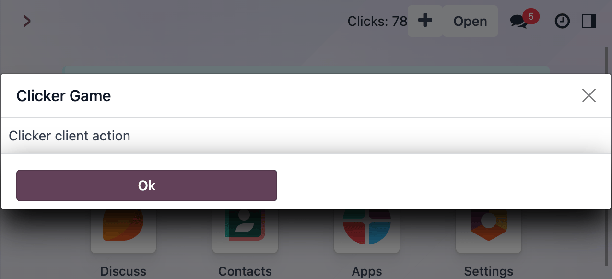
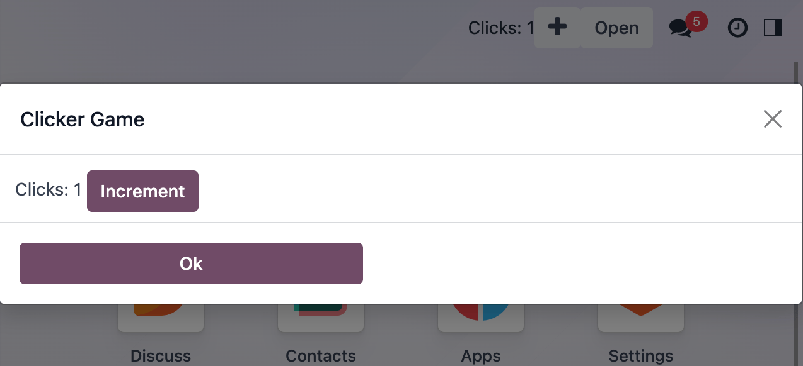
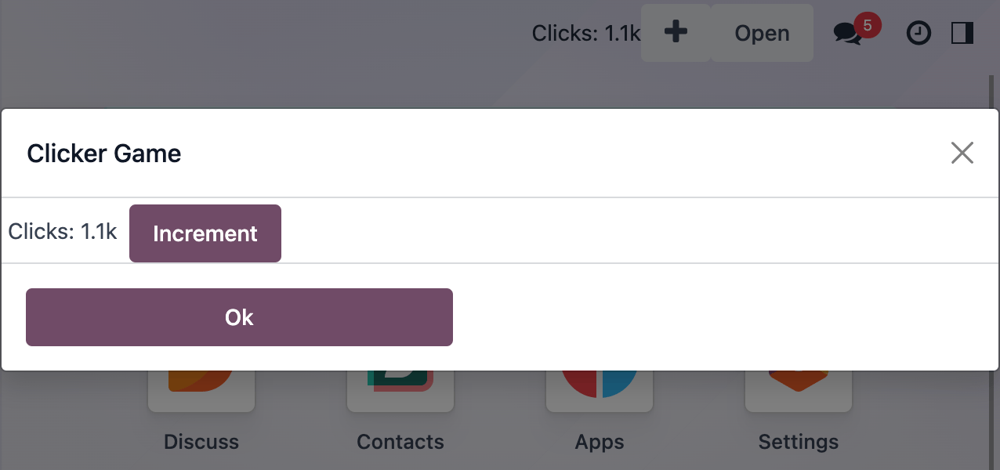
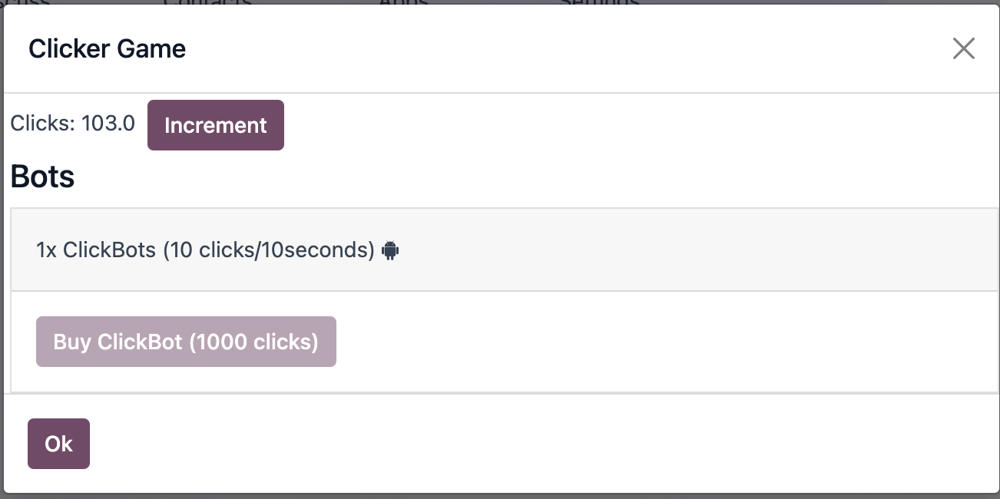
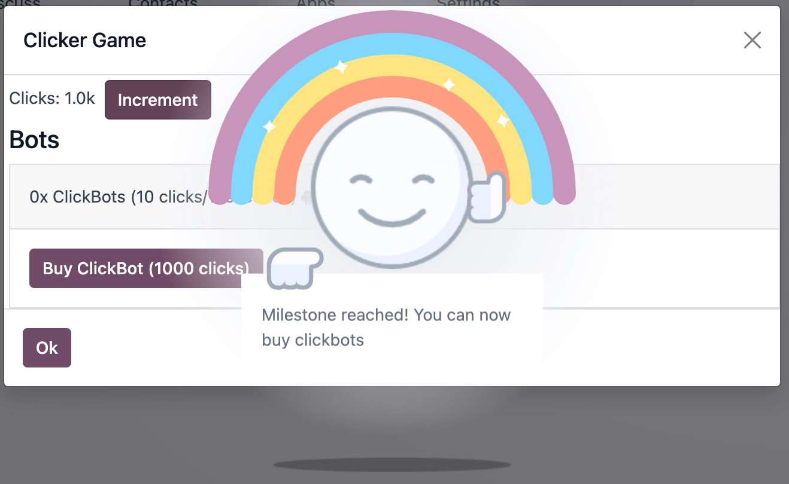
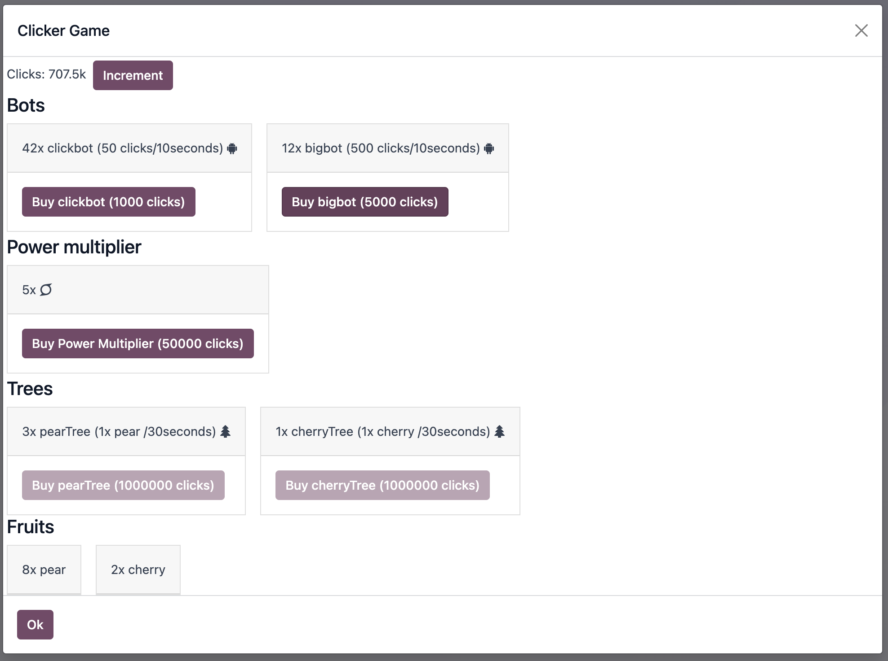
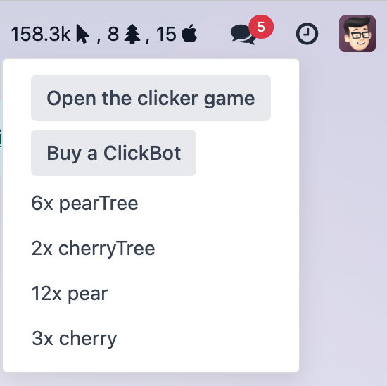
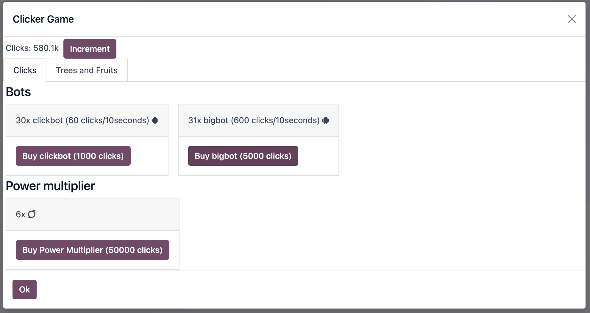
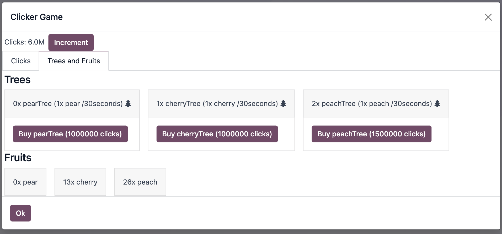

# Chapter 1: Build a Clicker game

For this project, we will build together a [clicker game](https://en.wikipedia.org/wiki/Incremental_game),
completely integrated with Odoo. In this game, the goal is to accumulate a large number of clicks, and
to automate the system. The interesting part is that we will use the Odoo user interface as our playground.
For example, we will hide bonuses in some random parts of the web client.

To get started, you need a running Odoo server and a development environment. Before getting
into the exercises, make sure you have followed all the steps described in this
[tutorial introduction](../master_odoo_web_framework.md#tutorials-master-odoo-web-framework-setup).

## 1. Create a systray item

To get started, we want to display a counter in the systray.

1. Create a `clicker_systray_item.js` (and `xml`) file with a hello world Owl component.
2. Register it to the systray registry, and make sure it is visible.
3. Update the content of the item so that it displays the following string: `Clicks: 0`, and
   add a button on the right to increment the value.


And voila, we have a completely working clicker game!

#### SEE ALSO
- [Documentation on the systray registry](../../reference/frontend/registries.md#frontend-registries-systray)
- [Example: adding a systray item to the registry](https://github.com/odoo/odoo/blob/c4fb9c92d7826ddbc183d38b867ca4446b2fb709/addons/web/static/src/webclient/user_menu/user_menu.js#L41-L42)

## 2. Count external clicks

Well, to be honest, it is not much fun yet. So let us add a new feature: we want all clicks in the
user interface to count, so the user is incentivized to use Odoo as much as possible! But obviously,
the intentional clicks on the main counter should still count more.

1. Use `useExternalListener` to listen on all clicks on `document.body`.
2. Each of these clicks should increase the counter value by 1.
3. Modify the code so that each click on the counter increased the value by 10
4. Make sure that a click on the counter does not increase the value by 11!
5. Also additional challenge: make sure the external listener capture the events, so we don't
   miss any clicks.

#### SEE ALSO
- [Owl documentation on useExternalListener](https://github.com/odoo/owl/blob/master/doc/reference/hooks.md#useexternallistener)
- [MDN page on event capture](https://developer.mozilla.org/en-US/docs/Learn/JavaScript/Building_blocks/Events#event_capture)

## 3. Create a client action

Currently, the current user interface is quite small: it is just a systray item. We certainly need
more room to display more of our game. To do that, let us create a client action. A client action
is a main action, managed by the web client, that displays a component.

1. Create a `client_action.js` (and `xml`) file, with a hello world component.
2. Register that client action in the action registry under the name `awesome_clicker.client_action`
3. Add a button on the systray item with the text `Open`. Clicking on it should open the
   client action `awesome_clicker.client_action` (use the action service to do that).
4. To avoid disrupting employees' workflow, we prefer the client action to open within a popover
   rather than in fullscreen mode. Modify the `doAction` call to open it in a popover.



#### SEE ALSO
- [How to create a client action](../../howtos/javascript_client_action.md#howtos-javascript-client-action)

## 4. Move the state to a service

For now, our client action is just a hello world component. We want it to display our game state, but
that state is currently only available in the systray item. So it means that we need to change the
location of our state to make it available for all our components. This is a perfect use case for services.

1. Create a `clicker_service.js` file with the corresponding service.
2. This service should export a reactive value (the number of clicks) and a few functions to update it:
   ```js
   const state = reactive({ clicks: 0 });
   ...
   return {
      state,
      increment(inc) {
         state.clicks += inc
      }
   };
   ```
3. Access the state in both the systray item and the client action (don't forget to `useState` it). Modify
   the systray item to remove its own local state and use it. Also, you can remove the `+10 clicks` button.
4. Display the state in the client action, and add a `+10` clicks button in it.



#### SEE ALSO
- [Short explanation on services](../discover_js_framework/02_build_a_dashboard.md#tutorials-discover-js-framework-services)

## 5. Use a custom hook

Right now, every part of the code that will need to use our clicker service will have to import `useService` and
`useState`. Since it is quite common, let us use a custom hook. It is also useful to put more emphasis on the
`clicker` part, and less emphasis on the `service` part.

1. Export a `useClicker` hook.
2. Update all current uses of the clicker service to the new hook:
   ```js
   this.clicker = useClicker();
   ```

#### SEE ALSO
- [Documentation on hooks:](https://github.com/odoo/owl/blob/master/doc/reference/hooks.md)

## 6. Humanize the displayed value

We will in the future display large numbers, so let us get ready for that. There is a `humanNumber` function that
format numbers in a easier to comprehend way: for example, `1234` could be formatted as `1.2k`

1. Use it to display our counters (both in the systray item and the client action).
2. Create a `ClickValue` component that display the value.

   #### NOTE
   Owl allows component that contains just text nodes!



#### SEE ALSO
- [definition of humanNumber function](https://github.com/odoo/odoo/blob/c638913df191dfcc5547f90b8b899e7738c386f1/addons/web/static/src/core/utils/numbers.js#L119)

## 7. Add a tooltip in `ClickValue` component

With the `humanNumber` function, we actually lost some precision on our interface. Let us display the real number
as a tooltip.

1. Tooltip needs an html element. Change the `ClickValue` to wrap the value in a `<span/>` element
2. Add a dynamic `data-tooltip` attribute to display the exact value.


#### SEE ALSO
- [Documentation in the tooltip service](https://github.com/odoo/odoo/blob/c638913df191dfcc5547f90b8b899e7738c386f1/addons/web/static/src/core/tooltip/tooltip_service.js#L17)

## 8. Buy ClickBots

Let us make our game even more interesting: once a player get to 1000 clicks for the first time, the game
should unlock a new feature: the player can buy robots for 1000 clicks. These robots will generate 10 clicks
every 10 seconds.

1. Add a `level` number to our state. This is a number that will be incremented at some milestones, and
   open new features
2. Add a `clickBots` number to our state. It represents the number of robots that have been purchased.
3. Modify the client action to display the number of click bots (only if `level >= 1`), with a `Buy`
   button that is enabled if `clicks >= 1000`. The `Buy` button should increment the number of clickbots by 1.
4. Set a 10s interval in the service that will increment the number of clicks by `10*clickBots`.
5. Make sure the Buy button is disabled if the player does not have enough clicks.



## 9. Refactor to a class model

The current code is written in a somewhat functional style. But to do so, we have to export the state and all its
update functions in our clicker object.  As this project grows, this may become more and more complex. To make it
simpler, let us split our business logic out of our service and into a class.

1. Create a `clicker_model` file that exports a reactive class. Move all the state and update functions from
   the service into the model.
2. Rewrite the clicker service to instantiate and export the clicker model class.

#### SEE ALSO
- [Example of subclassing Reactive](https://github.com/odoo/odoo/blob/c638913df191dfcc5547f90b8b899e7738c386f1/addons/web/static/src/model/relational_model/datapoint.js#L32)

## 10. Notify when a milestone is reached

There is not much feedback that something changed when we reached 1k clicks. Let us use the `effect` service
to communicate that information clearly. The problem is that our click model does not have access to services.
Also, we want to keep as much as possible the UI concern out of the model. So, we can explore a new strategy
for communication: event buses.

1. Update the clicker model to instantiate a bus, and to trigger a `MILESTONE_1k` event when we reach 1000 clicks
   for the first time.
2. Change the clicker service to listen to the same event on the model bus.
3. When that happens, use the `effect` service to display a rainbow man.
4. Add some text to explain that the user can now buy clickbots.



#### SEE ALSO
- [Owl documentation on event bus](https://github.com/odoo/owl/blob/master/doc/reference/utils.md#eventbus)
- [Documentation on effect service](../../reference/frontend/services.md#frontend-services-effect)

## 11. Add BigBots

Clearly, we need a way to provide the player with more choices. Let us add a new type of clickbot: `BigBots`,
which are just more powerful: they provide with 100 clicks each 10s, but they cost 5000 clicks

1. increment `level` when it gets to 5k (so it should be 2)
2. Update the state to keep track of bigbots
3. bigbots should be available at `level >=2`
4. Display the corresponding information in the client action


## 12. Add a new type of resource: power

Now, to add another scaling point, let us add a new type of resource: a power multiplier. This is a number
that can be increased at `level >= 3`, and multiplies the action of the bots (so, instead of providing
one click, clickbots now provide us with `multiplier` clicks).

1. increment `level` when it gets to 100k (so it should be 3).
2. update the state to keep track of the power (initial value is 1).
3. change bots to use that number as a multiplier.
4. Update the user interface to display and let the user purchase a new power level (costs: 50k).


## 13. Define some random rewards

We want the user to obtain sometimes bonuses, to reward using Odoo.

1. Define a list of rewards in `click_rewards.js`. A reward is an object with:
   - a `description` string.
   - a `apply` function that take the game state in argument and can modify it.
   - a `minLevel` number (optional) that describes at which unlock level the bonus is available.
   - a `maxLevel` number (optional) that describes at which unlock level a bonus is no longer available.

   For example:
   ```js
   export const rewards = [
      {
         description: "Get 1 click bot",
         apply(clicker) {
               clicker.increment(1);
         },
         maxLevel: 3,
      },
      {
         description: "Get 10 click bot",
         apply(clicker) {
               clicker.increment(10);
         },
         minLevel: 3,
         maxLevel: 4,
      },
      {
         description: "Increase bot power!",
         apply(clicker) {
               clicker.multipler += 1;
         },
         minLevel: 3,
      },
   ];
   ```

   You can add whatever you want to that list!
2. Define a function `getReward` that will select a random reward from the list of rewards that matches
   the current unlock level.
3. Extract the code that choose randomly in an array in a function `choose` that you can move to another `utils.js` file.

## 14. Provide a reward when opening a form view

1. Patch the form controller. Each time a form controller is created, it should randomly decides (1% chance)
   if a reward should be given.
2. If the answer is yes, call a method `getReward` on the model.
3. That method should choose a reward, send a sticky notification, with a button `Collect` that will
   then apply the reward, and finally, it should open the `clicker` client action.


#### SEE ALSO
- [Documentation on patching a class](../../reference/frontend/patching_code.md#frontend-patching-class)
- [Definition of patch function](https://github.com/odoo/odoo/blob/c638913df191dfcc5547f90b8b899e7738c386f1/addons/web/static/src/core/utils/patch.js#L71)
- [Example of patching a class](https://github.com/odoo/odoo/blob/c638913df191dfcc5547f90b8b899e7738c386f1/addons/pos_mercury/static/src/app/screens/receipt_screen/receipt_screen.js#L6)

## 15. Add commands in command palette

1. Add a command `Open Clicker Game` to the command palette.
2. Add another command: `Buy 1 click bot`.


#### SEE ALSO
- [Example of use of command provider registry](https://github.com/odoo/odoo/blob/c638913df191dfcc5547f90b8b899e7738c386f1/addons/web/static/src/core/debug/debug_providers.js#L10)

## 16. Add yet another resource: trees

It is now time to introduce a completely new type of resources. Here is one that should not be too controversial: trees.
We will now allow the user to plant (collect?) fruit trees. A tree costs 1 million clicks, but it will provide us with
fruits (either pears or cherries).

1. Update the state to keep track of various types of trees: pear/cherries, and their fruits.
2. Add a function that computes the total number of trees and fruits.
3. Define a new unlock level at `clicks >= 1 000 000`.
4. Update the client user interface to display the number of trees and fruits, and also, to buy trees.
5. Increment the fruit number by 1 for each tree every 30s.



## 17. Use a dropdown menu for the systray item

Our game starts to become interesting. But for now, the systray only displays the total number of clicks. We
want to see more information: the total number of trees and fruits. Also, it would be useful to have a quick
access to some commands and some more information. Let us use a dropdown menu!

1. Replace the systray item by a dropdown menu.
2. It should display the numbers of clicks, trees, and fruits, each with a nice icon.
3. Clicking on it should open a dropdown menu that displays more detailed information: each types of trees
   and fruits.
4. Also, a few dropdown items with some commands: open the clicker game, buy a clickbot, ...



## 18. Use a Notebook component

We now keep track of a lot more information. Let us improve our client interface by organizing the information
and features in various tabs, with the `Notebook` component:

1. Use the `Notebook` component.
2. All `click` content should be displayed in one tab.
3. All `tree/fruits` content should be displayed in another tab.



#### SEE ALSO
- [Odoo: Documentation on Notebook component](../../reference/frontend/owl_components.md#frontend-owl-notebook)
- [Owl: Documentation on slots](https://github.com/odoo/owl/blob/master/doc/reference/slots.md)
- [Tests of Notebook component](https://github.com/odoo/odoo/blob/c638913df191dfcc5547f90b8b899e7738c386f1/addons/web/static/tests/core/notebook_tests.js#L27)

## 19.  Persist the game state

You certainly noticed a big flaw in our game: it is transient. The game state is lost each time the user closes the
browser tab. Let us fix that. We will use the local storage to persist the state.

1. Import `browser` from `@web/core/browser/browser` to access the localstorage.
2. Serialize the state every 10s (in the same interval code) and store it on the local storage.
3. When the `clicker` service is started, it should load the state from the local storage (if any), or initialize itself
   otherwise.

## 20. Introduce state migration system

Once you persist state somewhere, a new problem arises: what happens when you update your code, so the shape of the state
changes, and the user opens its browser with a state that was created with an old version? Welcome to the world of
migration issues!

It is probably wise to tackle the problem early. What we will do here is add a version number to the state, and introduce
a system to automatically update the states if it is not up to date.

1. Add a version number to the state.
2. Define an (empty) list of migrations. A migration is an object with a `fromVersion` number, a `toVersion` number, and a `apply` function.
3. Whenever the code loads the state from the local storage, it should check the version number. If the state is not
   uptodate, it should apply all necessary migrations.

## 21. Add another type of trees

To test our migration system, let us add a new type of trees: peaches.

1. Add `peach` trees.
2. Increment the state version number.
3. Define a migration.


