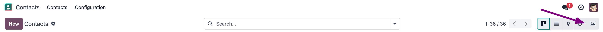
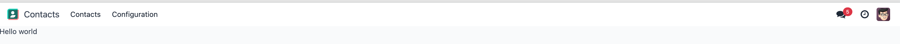
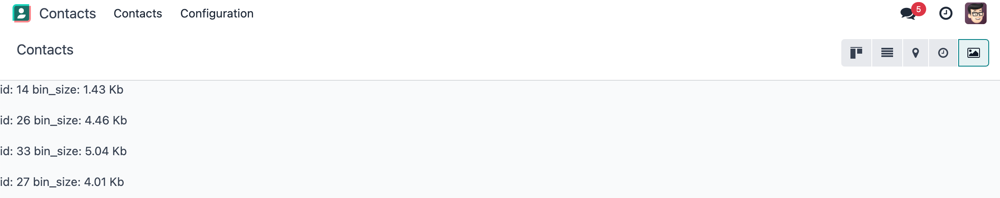
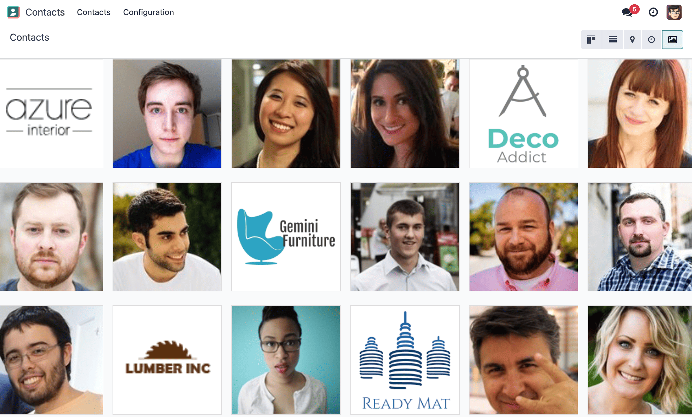

# Chapter 2: Create a Gallery View

Let us see how one can create a new view, completely from scratch. In a way, it is not very
difficult to do, but there are no really good resources on how to do it. Note that most situations
should be solved by either customizing an existing view, or with a client action.

For this exercise, let's assume that we want to create a `gallery` view, which is a view that lets
us represent a set of records with an image field.

The problem could certainly be solved with a kanban view, but this means that it is not possible to
have our normal kanban view and the gallery view in the same action.

Let us make a gallery view. Each gallery view will be defined by an `image_field` attribute in its
arch:

```xml
<gallery image_field="some_field"/>
```

To complete the tasks in this chapter, you will need to install the awesome_gallery addon. This
addon includes the necessary server files to add a new view.

## 1. Make a hello world view

First step is to create a JavaScript implementation with a simple component.

1. Create the `gallery_view.js` , `gallery_controller.js` and `gallery_controller.xml` files in
   `static/src`.
2. Implement a simple hello world component in `gallery_controller.js`.
3. In `gallery_view.js`, import the controller, create a view object, and register it in the
   view registry under the name `gallery`.
4. Add `gallery` as one of the view type in the `contacts.action_contacts` action.
5. Make sure that you can see your hello world component when switching to the gallery view.



## 2. Use the Layout component

So far, our gallery view does not look like a standard view. Let's use the `Layout` component to
have the standard features like other views.

1. Import the `Layout` component and add it to the `components` of `GalleryController`.
2. Update the template to use `Layout`. It needs a `display` prop, which can be found in
   `props.display`.


## 3. Parse the arch

For now, our gallery view does not do much. Let's start by reading the information contained in the
arch of the view.

The process of parsing an arch is usually done with a `ArchParser`, specific to each view. It
inherits from a generic `XMLParser` class.

1. Create the `ArchParser` class in its own file.
2. Use it to read the `image_field` information.
3. Update the `gallery` view code to add it to the props received by the controller.

#### NOTE
It is probably a little overkill to do it like that, since we basically only need to read one
attribute from the arch, but it is a design that is used by every other odoo views, since it
lets us extract some upfront processing out of the controller.

#### SEE ALSO
[Example: The graph arch parser](https://github.com/odoo/odoo/blob/17.0/addons/web/static/src/views/graph/graph_arch_parser.js)

## 4. Load some data

Let us now get some real data from the server. For that we must use `webSearchRead` from the orm
service.

1. Add a `loadImages(domain) {...}` method to the `GalleryController`. It should perform a
   `webSearchRead` call from the orm service to fetch records corresponding to the domain, and
   use `imageField` received in props.
2. If you didn't include `bin_size` in the context of the call, you will receive the image field
   encoded in base64. Make sure to put `bin_size` in the context to receive the size of the image
   field. We will display the image later.
3. Modify the `setup` code to call that method in the `onWillStart` and `onWillUpdateProps`
   hooks.
4. Modify the template to display the id and the size of each image inside the default slot of
   the `Layout` component.

#### NOTE
The loading data code will be moved into a proper model in a next exercise.



## 5. Solve the concurrency problem

For now, our code is not concurrency proof. If one changes the domain twice, it will trigger the
`loadImages(domain)` twice. We have thus two requests that can arrive at different time depending
on different factors. Receiving the response for the first request after receiving the response
for the second request will lead to an inconsistent state.

The `KeepLast` primitive from Odoo solves this problem, it manages a list of tasks, and only
keeps the last task active.

1. Import `KeepLast` from `@web/core/utils/concurrency`.
2. Instanciate a `KeepLast` object in the model.
3. Add the `webSearchRead` call in the `KeepLast` so that only the last call is resolved.

#### SEE ALSO
[Example: usage of KeepLast](https://github.com/odoo/odoo/blob/ebf646b44f747567ff8788c884f7f18dffd453e0/addons/web/static/src/core/model_field_selector/model_field_selector_popover.js#L164)

## 6. Reorganize code

Real views are a little bit more organized. This may be overkill in this example, but it is intended
to learn how to structure code in Odoo. Also, this will scale better with changing requirements.

1. Move all the model code in its own `GalleryModel` class.
2. Move all the rendering code in a `GalleryRenderer` component.
3. Import `GalleryModel` and `GalleryRenderer` in `GalleryController` to make it work.

## 7. Make the view extensible

To extends the view, one could import the gallery view object to modify it to their taste. The
problem is that for the moment, it is not possible to define a custom model or renderer because it
is hardcoded in the controller.

1. Import `GalleryModel` and `GalleryRenderer` in the gallery view file.
2. Add a `Model` and `Renderer` key to the gallery view object and assign them to `GalleryModel`
   and `GalleryRenderer`. Pass `Model` and `Renderer` as props to the controller.
3. Remove the hardcoded import in the controller and get them from the props.
4. Use [t-component](https://github.com/odoo/owl/blob/master/doc/reference/component.md#dynamic-sub-components) to
   have dynamic sub component.

#### NOTE
This is how someone could now extend the gallery view by modifying the renderer:

```js
/** @odoo-module */

import { registry } from '@web/core/registry';
import { galleryView } from '@awesome_gallery/gallery_view';
import { GalleryRenderer } from '@awesome_gallery/gallery_renderer';

export class MyExtendedGalleryRenderer extends GalleryRenderer {
   static template = "my_module.MyExtendedGalleryRenderer";
   setup() {
      super.setup();
      console.log("my gallery renderer extension");
   }
}

registry.category("views").add("my_gallery", {
   ...galleryView,
   Renderer: MyExtendedGalleryRenderer,
});
```

## 8. Display images

Update the renderer to display images in a nice way, if the field is set. If `image_field` is
empty, display an empty box instead.



## 9. Switch to form view on click

Update the renderer to react to a click on an image and switch to a form view. You can use the
`switchView` function from the action service.

#### SEE ALSO
[Code: The switchView function](https://github.com/odoo/odoo/blob/db2092d8d389fdd285f54e9b34a5a99cc9523d27/addons/web/static/src/webclient/actions/action_service.js#L1064)

## 10. Add an optional tooltip

It is useful to have some additional information on mouse hover.

1. Update the code to allow an optional additional attribute on the arch:
   ```xml
   <gallery image_field="some_field" tooltip_field="some_other_field"/>
   ```
2. On mouse hover, display the content of the tooltip field. It should work if the field is a
   char field, a number field or a many2one field. To put a tooltip to an html element, you can
   put the string in the `data-tooltip` attribute of the element.
3. Update the customer gallery view arch to add the customer as tooltip field.


#### SEE ALSO
[Example: usage of t-att-data-tooltip](https://github.com/odoo/odoo/blob/145fe958c212ddef9fab56a232c8b2d3db635c8e/addons/survey/static/src/views/widgets/survey_question_trigger/survey_question_trigger.xml#L8)

## 11. Add pagination

Let's add a pager on the control panel and manage all the pagination like in a normal Odoo view.


#### SEE ALSO
- [Code: The usePager hook](https://github.com/odoo/odoo/blob/17.0/addons/web/static/src/search/pager_hook.js)
- [Example: usePager in list controller](https://github.com/odoo/odoo/blob/48ef812a635f70571b395f82ffdb2969ce99da9e/addons/web/static/src/views/list/list_controller.js#L109-L128)

## 12.  Validating views

We have a nice and useful view so far. But in real life, we may have issue with users incorrectly
encoding the `arch` of their Gallery view: it is currently only an unstructured piece of XML.

Let us add some validation! In Odoo, XML documents can be described with an RN file
, and then validated.

1. Add an RNG file that describes the current grammar:
   - A mandatory attribute `image_field`.
   - An optional attribute: `tooltip_field`.
2. Add some code to make sure all views are validated against this RNG file.
3. While we are at it, let us make sure that `image_field` and `tooltip_field` are fields from
   the current model.

Since validating an RNG file is not trivial, here is a snippet to help:

```python
# -*- coding: utf-8 -*-
import logging
import os

from lxml import etree

from odoo.loglevels import ustr
from odoo.tools import misc, view_validation

_logger = logging.getLogger(__name__)

_viewname_validator = None

@view_validation.validate('viewname')
def schema_viewname(arch, **kwargs):
      """ Check the gallery view against its schema

      :type arch: etree._Element
      """
      global _viewname_validator

      if _viewname_validator is None:
         with misc.file_open(os.path.join('modulename', 'rng', 'viewname.rng')) as f:
            _viewname_validator = etree.RelaxNG(etree.parse(f))

      if _viewname_validator.validate(arch):
         return True

      for error in _viewname_validator.error_log:
         _logger.error(ustr(error))
      return False
```

#### SEE ALSO
[Example: The RNG file of the graph view](https://github.com/odoo/odoo/blob/70942e4cfb7a8993904b4d142e3b1749a40db806/odoo/addons/base/rng/graph_view.rng)

## 13. Uploading an image

Our gallery view does not allow users to upload images. Let us implement that.

1. Add a button on each image by using the `FileUploader` component.
2. The `FileUploader` component accepts the `onUploaded` props, which is called when the user
   uploads an image. Make sure to call `webSave` from the orm service to upload the new image.
3. You maybe noticed that the image is uploaded but it is not re-rendered by the browser.
   This is because the image link did not change so the browser do not re-fetch them. Include
   the `write_date` from the record to the image url.
4. Make sure that clicking on the upload button does not trigger the switchView.


#### SEE ALSO
- [Example: usage of FileUploader](https://github.com/odoo/odoo/blob/7710c3331ebd22f8396870bd0731f8c1152d9c41/addons/mail/static/src/web/activity/activity.xml#L48-L52)
- [Odoo: webSave definition](https://github.com/odoo/odoo/blob/ebd538a1942c532bcf1c9deeab3c25efe23b6893/addons/web/static/src/core/orm_service.js#L312)

## 14. Advanced tooltip template

For now we can only specify a tooltip field. But what if we want to allow to write a specific
template for it ?

1. Replace the `res.partner` gallery arch view in `awesome_gallery/views/views.xml` with
   the arch in example above. Don't worry if it does not pass the rng validation.
2. Modify the gallery rng validator to accept the new arch structure.
3. The arch parser should parse the fields and the tooltip template. Import `visitXML` from
   `@web/core/utils/xml` and use it to parse field names and the tooltip template.
4. Make sure that the model call the `webSearchRead` by including the parsed field names in the
   specification.
5. The renderer (or any sub-component you created for it) should receive the parsed tooltip
   template. Manipulate this template to replace the `<field>` element into a `<t t-esc="x">`
   element.
6. Register the template to Owl thanks to the `xml` function from `@odoo/owl`.
7. Use the `useTooltip` hook from `@web/core/tooltip/tooltip_hook` to display the
   tooltips. This hooks take as argument the Owl template and the variable needed by the
   template.


#### SEE ALSO
- [Example: useTooltip used in Kaban](https://github.com/odoo/odoo/blob/0e6481f359e2e4dd4f5b5147a1754bb3cca57311/addons/web/static/src/views/kanban/kanban_record.js#L189-L192)
- [Example: visitXML usage](https://github.com/odoo/odoo/blob/48ef812a635f70571b395f82ffdb2969ce99da9e/addons/web/static/src/views/list/list_arch_parser.js#L19)
- [Owl: Inline templates with xml helper function](https://github.com/odoo/owl/blob/master/doc/reference/templates.md#inline-templates)
