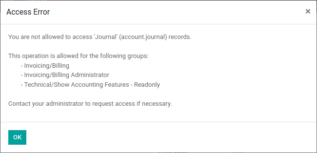

# Restrict access to data

#### IMPORTANT
This tutorial is an extension of the [Server framework 101](server_framework_101/) tutorial. Make sure you have
completed it and use the `estate` module you have built as a base for the exercises in this
tutorial.

So far we have mostly concerned ourselves with implementing useful features.
However in most business scenarios *security* quickly becomes a concern:
currently,

* Any employee (which is what `group_user` stands for) can create, read,
  update or delete properties, property types, or property tags.
* If `estate_account` is installed then only agents allowed to interact
  with invoicing can confirm sales as that's necessary to [create an
  invoice](server_framework_101/13_other_module.md#tutorials-server-framework-101-13-other-module-create).

However:

* We do not want third parties to be able to access properties directly.
* Not all our employees may be real-estate agents (e.g. administrative
  personnel, property managers, ...), we don't want non-agents to see the
  available properties.
* Real-estate agents don't need or get to decide what property types or tags are
  *available*.
* Real-estate agents can have *exclusive* properties, we do not want one agent
  to be able to manage another's exclusives.
* All real-estate agents should be able to confirm the sale of a property they
  can manage, but we do not want them to be able to validate or mark as paid
  any invoice in the system.

#### NOTE
We may actually be fine with some or most of these for a small business.

Because it's easier for users to disable unnecessary security rules than it
is to create them from nothing, it's better to err on the side of caution
and limit access: users can relax that access if necessary or convenient.

## Groups

#### SEE ALSO
The documentation related to this topic can be found in [the security
reference](../reference/backend/security.md#reference-security).

[Coding guidelines](../../contributing/development/coding_guidelines.md) document the format and
location of master data items.

It would not be practical to attach individual security rules to employees any
time we need a change so *groups* link security rules and users. They correspond
to roles that can be assigned to employees.

For most Odoo applications <sup>[1](#app)</sup> a good baseline is to have *user* and
*manager* (or administrator) roles: the manager can change the configuration of
the application and oversee the entirety of its use while the user can well,
use the application <sup>[2](#appuser)</sup>.

This baseline seems sufficient for us:

* Real estate managers can configure the system (manage available types and
  tags) as well as oversee every property in the pipeline.
* Real estate agents can manage the properties under their care, or properties
  which are not specifically under the care of any agent.

In keeping with Odoo's data-driven nature, a group is no more than a record of
the `res.groups` model. They are normally part of a module's [master data](define_module_data.md), defined in one of the module's data files.

As simple example [can be found here](https://github.com/odoo/odoo/blob/532c083cbbe0ee6e7a940e2bdc9c677bd56b62fa/addons/hr/security/hr_security.xml#L9-L14).

## Access Rights

#### SEE ALSO
The documentation related to this topic can be found at
[Access Rights](../reference/backend/security.md#reference-security-acl).

Access rights were first introduced in [Chapter 4: Security - A Brief Introduction](server_framework_101/04_securityintro.md).

Access rights are a way to give users access to models *via* groups: associate
an access right to a group, then all users with that group will have the access.

For instance we don't want real-estate agents to be able to modify what property
types are available, so we would not link that access to the "user" group.

Access rights can only give access, they can't remove it: when access is
checked, the system looks to see if *any* access right associated with the user
(via any group) grants that access.

| group   | create   | read   | update   | delete   |
|---------|----------|--------|----------|----------|
| A       | X        | X      |          |          |
| B       |          | X      |          |          |
| C       |          |        | X        |          |

A user with the groups A and C will be able to do anything but delete the object
while one with B and C will be able to read and update it, but not create or delete it.

#### NOTE
* The group of an access right can be omitted, this means the ACL applies
  to *every user*, this is a useful but risky fallback as depending on the
  applications installed it can grant even non-users access to the model.
* If no access right applies to a user, they are not granted access
  (default-deny).
* If a menu item points to a model to which a user doesn't have access and
  has no submenus which the user can see, the menu will not be displayed.

Since the "demo" user was not made a real-estate agent or manager, they should
not even be able to see the real-estate application. Use a private tab or window
to check for this (the "demo" user has the password "demo").

## Record Rules

#### SEE ALSO
The documentation related to this topic can be found at
[Record Rules](../reference/backend/security.md#reference-security-rules).

Access rights can grant access to an entire model but often we need to be
more specific: while an agent can interact with properties in general we may not
want them to update or even see properties managed by one of their colleagues.

Record *rules* provide that precision: they can grant or reject access to
individual records:

```xml
<record id="rule_id" model="ir.rule">
    <field name="name">A description of the rule's role</field>
    <field name="model_id" ref="model_to_manage"/>
    <field name="perm_read" eval="False"/>
    <field name="groups" eval="[Command.link(ref('base.group_user'))]"/>
    <field name="domain_force">[
        '|', ('user_id', '=', user.id),
             ('user_id', '=', False)
    ]</field>
</record>
```

The [Search domains](../reference/backend/orm/#reference-orm-domains) is how access is managed: if the record passes
then access is granted, otherwise access is rejected.

The rule above:

* Only applies to the "create", "update" (write) and "delete" (unlink)
  operations: here we want every employee to be able to see other users' records
  but only the author / assignee can update a record.
* Is [non-global](../reference/backend/security.md#reference-security-rules-global) so we can provide an
  additional rule for e.g. managers.
* Allows the operation if the current user (`user.id`) is set (e.g. created,
  or is assigned) on the record, or if the record has no associated user at all.

#### NOTE
If no rule is defined or applies to a model and operation, then the
operation is allowed (*default-allow*), this can have odd effects
if access rights are not set up correctly (are too permissive).

## Security Override

### Bypassing Security

If you try to mark a property as "sold" as the real estate agent, you should get
an access error:



This happens because `estate_account` tries to create an invoice during the
process, but creating an invoice requires the right to all invoice management.

We want agents to be able to confirm a sale without them having full invoicing
access, which means we need to *bypass* the normal security checks of Odoo in
order to create an invoice *despite* the current user not having the right to
do so.

There are two main ways to bypass existing security checks in Odoo, either
wilfully or as a side-effect:

* The `sudo()` method will create a new recordset in "sudo mode", this ignores
  all access rights and record rules (although hard-coded group and user checks
  may still apply).
* Performing raw SQL queries will bypass access rights and record rules as a
  side-effect of bypassing the ORM itself.

### Programmatically checking security

In Odoo, access rights and record rules are only checked *when performing data
access via the ORM* e.g. creating, reading, searching, writing, or unlinking a
record via ORM methods. Other methods do *not* necessarily check against any
sort of access rights.

In the previous section, we bypassed the record rules when creating the invoice
in `action_sold`. This bypass can be reached by any user without any access
right being checked:

- Add a print to `action_sold` in `estate_account` before the creation of
  the invoice (as creating the invoice accesses the property, therefore triggers
  an ACL check) e.g.:
  ```default
  print(" reached ".center(100, '='))
  ```

You should see `reached` in your Odoo log, followed by an access error.

*Currently* the accesses are implicitly checked by accessing data on `self` as
well as calling `super()` (which does the same and *updates* `self`),
triggering access errors and cancelling the transaction "uncreating" our
invoice.

*However* if this changes in the future, or we add side-effects to the method
(e.g. reporting the sale to a government agency), or bugs are introduced in
`estate`, ... it would be possible for non-agents to trigger operations they
should not have access to.

Therefore when performing non-CRUD operations, or legitimately bypassing the
ORM or security, or when triggering other side-effects, it is extremely
important to perform *explicit security checks*.

Explicit security checks can be performed by:

* Checking who the current user is (`self.env.user`) and match them against
  specific models or records.
* Checking that the current user has specific groups hard-coded to allow or deny
  an operation (`self.env.user.has_group`).
* Calling the `check_access_rights(operation)` method on a recordset, this
  verifies whether the current user has access to the model itself.
* Calling `check_access_rule(operations)` on a non-empty recordset, this
  verifies that the current user is allowed to perform the operation on *every*
  record of the set.

#### WARNING
Checking access rights and checking record rules are separate
operations, if you're checking record rules you usually want to
also check access rights beforehand.

<a id="tutorials-restrict-data-access-multicompany"></a>

## Multi-company security

#### SEE ALSO
[Multi-company Guidelines](../howtos/company.md#reference-howtos-company) for an overview of multi-company facilities
in general, and [multi-company security rules](../howtos/company.md#howto-company-security)
in particular.

Documentation on rules in general can, again, be found at
[Record Rules](../reference/backend/security.md#reference-security-rules).

For one reason or another we might need to manage our real-estate business
as multiple companies e.g. we might have largely autonomous agencies, a
franchise setup, or multiple brands (possibly from having acquired other
real-estate businesses) which remain legally or financially separate from one
another.

Odoo can be used to manage multiple companies inside the same system, however
the actual handling is up to individual modules: Odoo itself provides the tools
to manage the issue of company-dependent fields and *multi-company rules*,
which is what we're going to concern ourselves with.

We want different agencies to be "siloed" from one another, with properties
belonging to a given agency and users (whether agents or managers) only able to
see properties linked to their agency.

As before, because this is based on non-trivial records it's easier for a user
to relax rules than to tighten them so it makes sense to default to a
relatively stronger security model.

Multi-company rules are simply record rules based on the `company_ids` or
`company_id` fields:

* `company_ids` is all the companies to which the current user has access
* `company_id` is the currently active company (the one the user is currently
  working in / for).

Multi-company rules will *usually* use the former i.e. check if the record is
associated with *one* of the companies the user has access to:

```xml
<record model="ir.rule" id="hr_appraisal_plan_comp_rule">
    <field name="name">Appraisal Plan multi-company</field>
    <field name="model_id" ref="model_hr_appraisal_plan"/>
    <field name="domain_force">[
        '|', ('company_id', '=', False),
             ('company_id', 'in', company_ids)
    ]</field>
</record>
```

#### WARNING
remember to `--update` your module when you change its model or
data

## Visibility != security

Specific Odoo models can be associated directly with groups (or companies, or
users). It is important to figure out whether this association is a *security*
or a *visibility* feature before using it:

* *Visibility* features mean a user can still access the model or record
  otherwise, either through another part of the interface or by [performing
  operations remotely using RPC](../reference/external_api.md), things might just not be
  visible in the web interface in some contexts.
* *Security* features mean a user can not access records, fields or operations.

Here are some examples:

* Groups on *model fields* (in Python) are a security feature, users outside the
  group will not be able to retrieve the field, or even know it exists.

  Example: in server actions, [only system users can see or update Python code](https://github.com/odoo/odoo/blob/7058e338a980268df1c502b8b2860bdd8be9f727/odoo/addons/base/models/ir_actions.py#L414-L417).
* Groups on *view elements* (in XML) are a visibility feature, users outside the
  group will not be able to see the element or its content in the form but they
  will otherwise be able to interact with the object (including that field).

  Example: [only managers have an immediate filter to see their teams' leaves](https://github.com/odoo/odoo/blob/8e19904bcaff8300803a7b596c02ec45fcf36ae6/addons/hr_holidays/report/hr_leave_reports.xml#L16).
* Groups on menus and actions are visibility features, the menu or action will
  not be shown in the interface but that doesn't prevent directly interacting
  with the underlying object.

  Example: [only system administrators can see the elearning settings menu](https://github.com/odoo/odoo/blob/ff828a3e0c5386dc54e6a46fd71de9272ef3b691/addons/website_slides/views/website_slides_menu_views.xml#L64-L69).

Despite not having access to the Property Types and Property Tags menus anymore,
agents can still access the underlying objects since they can still select
tags or a type to set on their properties.

* <a id='app'>**[1]**</a> An Odoo Application is a group of related modules covering a business area or field, usually composed of a base module and a number of expansions on that base to add optional or specific features, or link to other business areas.
* <a id='appuser'>**[2]**</a> For applications which would be used by most or every employees, the "application user" role might be done away with and its abilities granted to all employees directly e.g. generally all employees can submit expenses or take time off.
