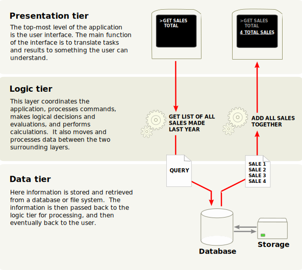

# 01\_architecture

## Chapter 1: Architecture Overview

### Multitier application

Odoo follows a [multitier architecture](https://en.wikipedia.org/wiki/Multitier_architecture), meaning that the presentation, the business\
logic and the data storage are separated. More specifically, it uses a three-tier architecture\
(image from Wikipedia):



The presentation tier is a combination of HTML5, JavaScript and CSS. The logic tier is exclusively\
written in Python, while the data tier only supports PostgreSQL as an RDBMS.

Depending on the scope of your module, Odoo development can be done in any of these tiers.\
Therefore, before going any further, it may be a good idea to refresh your memory if you don't have\
an intermediate level in these topics.

In order to go through this tutorial, you will need a very basic knowledge of HTML and an intermediate\
level of Python. Advanced topics will require more knowledge in the other subjects. There are\
plenty of tutorials freely accessible, so we cannot recommend one over another since it depends\
on your background.

For reference this is the official [Python tutorial](https://docs.python.org/3.7/tutorial/).

**NOTE**

Since version 15.0, Odoo is actively transitioning to using its own in-house developed [OWL\
framework](https://odoo.github.io/owl/) as part of its presentation tier. The legacy JavaScript\
framework is still supported but will be deprecated over time. This will be discussed further in\
advanced topics.

### Odoo modules

Both server and client extensions are packaged as _modules_ which are\
optionally loaded in a _database_. A module is a collection of functions and data that target a\
single purpose.

Odoo modules can either add brand new business logic to an Odoo system or\
alter and extend existing business logic. One module can be created to add your\
country's accounting rules to Odoo's generic accounting support, while\
a different module can add support for real-time visualisation of a bus fleet.

Everything in Odoo starts and ends with modules.

Terminology: developers group their business features in Odoo _modules_. The main user-facing\
modules are flagged and exposed as _Apps_, but a majority of the modules aren't Apps. _Modules_\
may also be referred to as _addons_ and the directories where the Odoo server finds them\
form the `addons_path`.

#### Composition of a module

An Odoo module **can** contain a number of elements:

[Business objects](../../reference/backend/orm.md#reference-orm)
: A business object (e.g. an invoice) is declared as a Python class. The fields defined in
  these classes are automatically mapped to database columns thanks to the
   layer.

[Object views](../../reference/user_interface/view_architectures.md)
: Define UI display

[Data files](../../reference/backend/data.md#reference-data)
: XML or CSV files declaring the model data:
  <br/>
  * [views](../../reference/user_interface/view_architectures.md) or
    [reports](../../reference/backend/reports.md#reference-reports),
  * configuration data (modules parametrization, [security rules](../../reference/backend/security.md#reference-security)),
  * demonstration data
  * and more

[Web controllers](../../reference/backend/http.md#reference-controllers)
: Handle requests from web browsers

Static web data\
: Images, CSS or JavaScript files used by the web interface or website

None of these elements are mandatory. Some modules may only add data files (e.g. country-specific\
accounting configuration), while others may only add business objects. During this training, we will\
create business objects, object views and data files.

#### Module structure

Each module is a directory within a *module directory*. Module directories
are specified by using the [`--addons-path`](../../reference/cli.md#cmdoption-odoo-bin-addons-path)
option.

An Odoo module is declared by its [manifest](../../reference/backend/module.md#reference-module-manifest).

When an Odoo module includes business objects (i.e. Python files), they are organized as a[Python package](https://docs.python.org/3/tutorial/modules.html#packages)\
with a `__init__.py` file. This file contains import instructions for various Python\
files in the module.

Here is a simplified module directory:

```bash
module
├── models
│   ├── *.py
│   └── __init__.py
├── data
│   └── *.xml
├── __init__.py
└── __manifest__.py
```

### Odoo Editions

Odoo is available in [two versions](https://www.odoo.com/page/editions): Odoo Enterprise (licensed & shared sources) and Odoo Community\
(open-source). In addition to services such as support or upgrades, the Enterprise version provides extra\
functionalities to Odoo. From a technical point-of-view, these functionalities are simply\
new modules installed on top of the modules provided by the Community version.

Ready to start? It is now time to [write your own application](02_newapp.md)!
