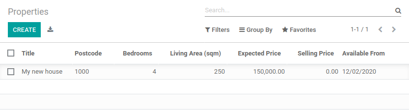
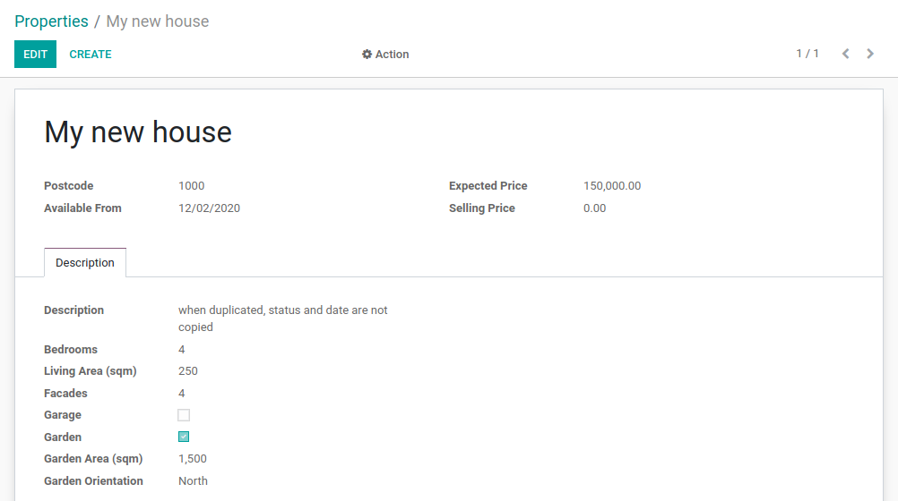
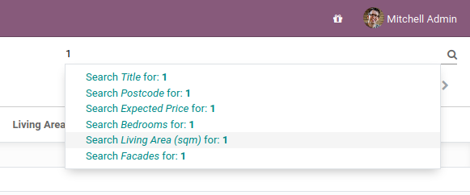
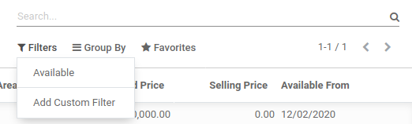
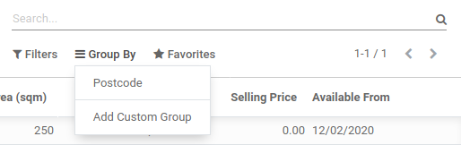

# Chapter 6: Basic Views

We have seen in the [previous chapter](05_firstui.md) that Odoo is able
to generate default views for a given model. In practice, the default view is **never** acceptable
for a business application. Instead, we should at least organize the various fields in a logical
manner.

Views are defined in XML files with actions and menus. They are instances of the
`ir.ui.view` model.

In our real estate module, we need to organize the fields in a logical way:

- in the list (tree) view, we want to display more than just the name.
- in the form view, the fields should be grouped.
- in the search view, we must be able to search on more than just the name. Specifically, we want a
  filter for the 'Available' properties and a shortcut to group by postcode.

## List

**Reference**: the documentation related to this topic can be found in
[List](../../reference/user_interface/view_architectures.md#reference-view-architectures-list).

#### NOTE
**Goal**: at the end of this section, the list view should look like this:



List views, also called tree views, display records in a tabular form.

Their root element is `<tree>`. The most basic version of this view simply
lists all the fields to display in the table (where each field is a column):

```xml
<tree string="Tests">
    <field name="name"/>
    <field name="last_seen"/>
</tree>
```

A simple example can be found
[here](https://github.com/odoo/odoo/blob/6da14a3aadeb3efc40f145f6c11fc33314b2f15e/addons/crm/views/crm_lost_reason_views.xml#L46-L54).

As always, you need to restart the server (do not forget the `-u` option) and refresh the browser
to see the result.

#### WARNING
You will probably use some copy-paste in this chapter, therefore always make sure that the `id`
remains unique for each view!

## Form

**Reference**: the documentation related to this topic can be found in
[Form](../../reference/user_interface/view_architectures.md#reference-view-architectures-form).

#### NOTE
**Goal**: at the end of this section, the form view should look like this:



Forms are used to create and edit single records.

Their root element is `<form>`. They are composed of high-level structure
elements (groups and notebooks) and interactive elements (buttons and fields):

```xml
<form string="Test">
    <sheet>
        <group>
            <group>
                <field name="name"/>
            </group>
            <group>
                <field name="last_seen"/>
            </group>
        </group>
        <notebook>
            <page string="Description">
                <field name="description"/>
            </page>
        </notebook>
    </sheet>
</form>
```

It is possible to use regular HTML tags such as `div` and `h1` as well as the the `class` attribute
(Odoo provides some built-in classes) to fine-tune the look.

A simple example can be found
[here](https://github.com/odoo/odoo/blob/6da14a3aadeb3efc40f145f6c11fc33314b2f15e/addons/crm/views/crm_lost_reason_views.xml#L16-L44).

This might require some trial and error before you get to the expected result ;-) It is advised
that you add the fields and the tags one at a time to help understand how it works.

In order to avoid relaunching the server every time you do a modification to the view, it can
be convenient to use the `--dev xml` parameter when launching the server:

```console
$ ./odoo-bin --addons-path=addons,../enterprise/,../tutorials/ -d rd-demo -u estate --dev xml
```

This parameter allows you to just refresh the page to view your view modifications.

## Search

**Reference**: the documentation related to this topic can be found in
[Search](../../reference/user_interface/view_architectures.md#reference-view-architectures-search).

#### NOTE
**Goal**: at the end of this section, the search view should look like this:



Search views are slightly different from the list and form views since they don't display
*content*. Although they apply to a specific model, they are used to filter
other views' content (generally aggregated views such as
[List](../../reference/user_interface/view_architectures.md#reference-view-architectures-list)). Beyond the difference in use case, they are
defined the same way.

Their root element is `<search>`. The most basic version of this view simply
lists all the fields for which a shortcut is desired:

```xml
<search string="Tests">
    <field name="name"/>
    <field name="last_seen"/>
</search>
```

The default search view generated by Odoo provides a shortcut to filter by `name`. It is very
common to add the fields which the user is likely to filter on in a customized search view.

After restarting the server, it should be possible to filter on the given fields.

Search views can also contain `<filter>` elements, which act as toggles for
predefined searches. Filters must have one of the following attributes:

- `domain`: adds the given domain to the current search
- `context`: adds some context to the current search; uses the key `group_by` to group
  results on the given field name

A simple example can be found
[here](https://github.com/odoo/odoo/blob/715a24333bf000d5d98b9ede5155d3af32de067c/addons/delivery/views/delivery_view.xml#L30-L44).

Before going further in the exercise, it is necessary to introduce the 'domain' concept.

### Domains

**Reference**: the documentation related to this topic can be found in
[Search domains](../../reference/backend/orm.md#reference-orm-domains).

In Odoo, a domain encodes conditions on
records: a domain is a list of criteria used to select a subset of a model's
records. Each criterion is a triplet with a *field name*, an *operator* and a *value*.
A record satisfies a criterion if the specified field meets the condition of the operator applied to the value.

For instance, when used on the *Product* model the following domain selects
all *services* with a unit price greater than *1000*:

```default
[('product_type', '=', 'service'), ('unit_price', '>', 1000)]
```

By default criteria are combined with an implicit AND, meaning *every* criterion
needs to be satisfied for a record to match a domain. The logical operators
`&` (AND), `|` (OR) and `!` (NOT) can be used to explicitly combine
criteria. They are used in prefix position (the operator is inserted before
its arguments rather than between). For instance, to select products 'which are
services *OR* have a unit price which is *NOT* between 1000 and 2000':

```default
['|',
    ('product_type', '=', 'service'),
    '!', '&',
        ('unit_price', '>=', 1000),
        ('unit_price', '<', 2000)]
```

#### NOTE
XML does not allow `<` and `&` to be used inside XML
elements. To avoid parsing errors, entity references should be used:
`&lt;` for `<` and `&amp;` for `&`. Other entity references
(`&gt;`, `&apos;` & `&quot;`) are optional.

Looking good? At this point we are already able to create models and design a user interface which
makes sense business-wise. However, a key component is still missing: the
[link between models](07_relations.md).
