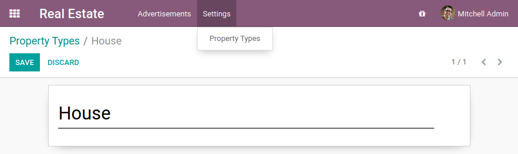
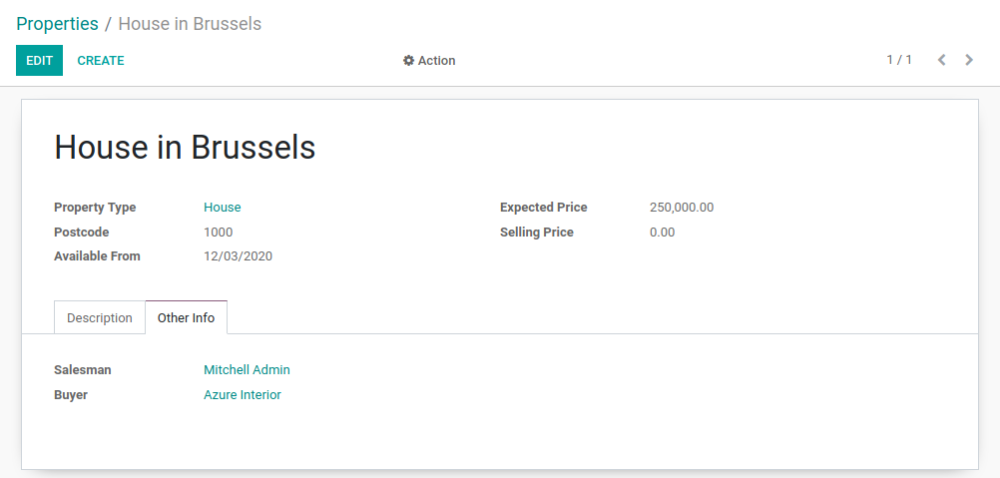
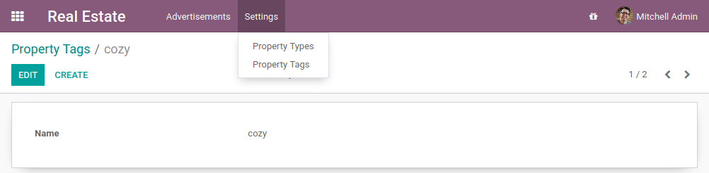
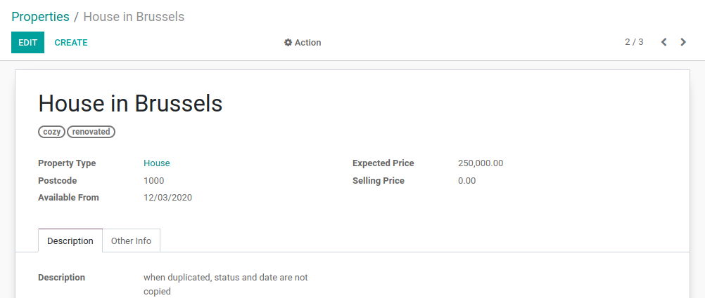
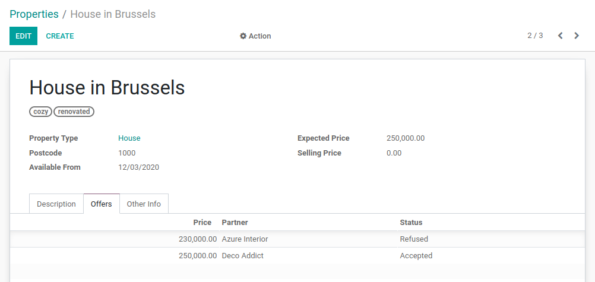

# Chapter 7: Relations Between Models

The [previous chapter](06_basicviews.md) covered the creation of custom
views for a model containing basic fields. However, in any real business scenario we need more than
one model. Moreover, links between models are necessary. One can easily imagine one model containing
the customers and another one containing the list of users. You might need to refer to a customer
or a user on any existing business model.

In our real estate module, we want the following information for a property:

- the customer who bought the property
- the real estate agent who sold the property
- the property type: house, apartment, penthouse, castle...
- a list of tags characterizing the property: cozy, renovated...
- a list of the offers received

## Many2one

**Reference**: the documentation related to this topic can be found in
`Many2one`.

#### NOTE
**Goal**: at the end of this section:

- a new `estate.property.type` model should be created with the corresponding menu, action and views.


- three Many2one fields should be added to the `estate.property` model: property type, buyer and seller.



In our real estate module, we want to define the concept of property type. A property type
is, for example, a house or an apartment. It is a standard business need to categorize
properties according to their type, especially to refine filtering.

A property can have **one** type, but the same type can be assigned to **many** properties.
This is supported by the **many2one** concept.

A many2one is a simple link to another object. For example, in order to define a link to the
`res.partner` in our test model, we can write:

```default
partner_id = fields.Many2one("res.partner", string="Partner")
```

By convention, many2one fields have the `_id` suffix. Accessing the data in the partner
can then be easily done with:

```default
print(my_test_object.partner_id.name)
```

#### SEE ALSO
[foreign keys](https://www.postgresql.org/docs/12/tutorial-fk.html)

In practice a many2one can be seen as a dropdown list in a form view.

Once again, restart the server and refresh to see the results!

In the real estate module, there are still two missing pieces of information we want on a property:
the buyer and the salesperson. The buyer can be any individual, but on the other hand the
salesperson must be an employee of the real estate agency (i.e. an Odoo user).

In Odoo, there are two models which we commonly refer to:

- `res.partner`: a partner is a physical or legal entity. It can be a company, an individual or
  even a contact address.
- `res.users`: the users of the system. Users can be 'internal', i.e. they have
  access to the Odoo backend. Or they can be 'portal', i.e. they cannot access the backend, only the
  frontend (e.g. to access their previous orders in eCommerce).

#### NOTE
The object `self.env` gives access to request parameters and other useful
things:

- `self.env.cr` or `self._cr` is the database *cursor* object; it is
  used for querying the database
- `self.env.uid` or `self._uid` is the current user's database id
- `self.env.user` is the current user's record
- `self.env.context` or `self._context` is the context dictionary
- `self.env.ref(xml_id)` returns the record corresponding to an XML id
- `self.env[model_name]` returns an instance of the given model

Now let's have a look at other types of links.

## Many2many

**Reference**: the documentation related to this topic can be found in
`Many2many`.

#### NOTE
**Goal**: at the end of this section:

- a new `estate.property.tag` model should be created with the corresponding menu and action.


- tags should be added to the `estate.property` model:



In our real estate module, we want to define the concept of property tags. A property tag
is, for example, a property which is 'cozy' or 'renovated'.

A property can have **many** tags and a tag can be assigned to **many** properties.
This is supported by the **many2many** concept.

A many2many is a bidirectional multiple relationship: any record on one side can be related to any
number of records on the other side. For example, in order to define a link to the
`account.tax` model on our test model, we can write:

```default
tax_ids = fields.Many2many("account.tax", string="Taxes")
```

By convention, many2many fields have the `_ids` suffix. This means that several taxes can be
added to our test model. It behaves as a list of records, meaning that accessing the data must be
done in a loop:

```default
for tax in my_test_object.tax_ids:
    print(tax.name)
```

A list of records is known as a *recordset*, i.e. an ordered collection of records. It supports
standard Python operations on collections, such as `len()` and `iter()`, plus extra set
operations like `recs1 | recs2`.

## One2many

**Reference**: the documentation related to this topic can be found in
`One2many`.

#### NOTE
**Goal**: at the end of this section:

- a new `estate.property.offer` model should be created with the corresponding form and tree view.
- offers should be added to the `estate.property` model:



In our real estate module, we want to define the concept of property offers. A property offer
is an amount a potential buyer offers to the seller. The offer can be lower or higher than the
expected price.

An offer applies to **one** property, but the same property can have **many** offers.
The concept of **many2one** appears once again. However, in this case we want to display the list
of offers for a given property so we will use the **one2many** concept.

A one2many is the inverse of a many2one. For example, we defined
on our test model a link to the `res.partner` model thanks to the field `partner_id`.
We can define the inverse relation, i.e. the list of test models linked to our partner:

```default
test_ids = fields.One2many("test_model", "partner_id", string="Tests")
```

The first parameter is called the `comodel` and the second parameter is the field we want to
inverse.

By convention, one2many fields have the `_ids` suffix. They behave as a list of records, meaning
that accessing the data must be done in a loop:

```default
for test in partner.test_ids:
    print(test.name)
```

There are several important things to notice here. First, we don't need an action or a menu for all
models. Some models are intended to be accessed only through another model. This is the case in our
exercise: an offer is always accessed through a property.

Second, despite the fact that the `property_id` field is required, we did not include it in the
views. How does Odoo know which property our offer is linked to? Well that's part of the
magic of using the Odoo framework: sometimes things are defined implicitly. When we create
a record through a one2many field, the corresponding many2one is populated automatically
for convenience.

Still alive? This chapter is definitely not the easiest one. It introduced a couple of new concepts
while relying on everything that was introduced before. The
[next chapter](08_compute_onchange.md) will be lighter, don't worry ;-)
