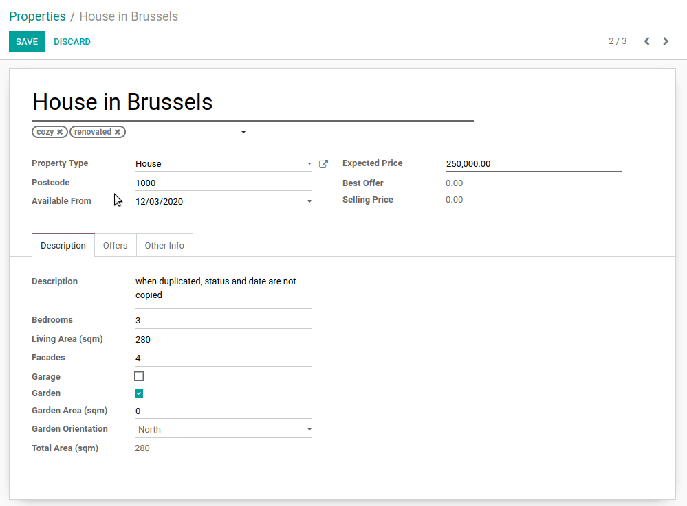
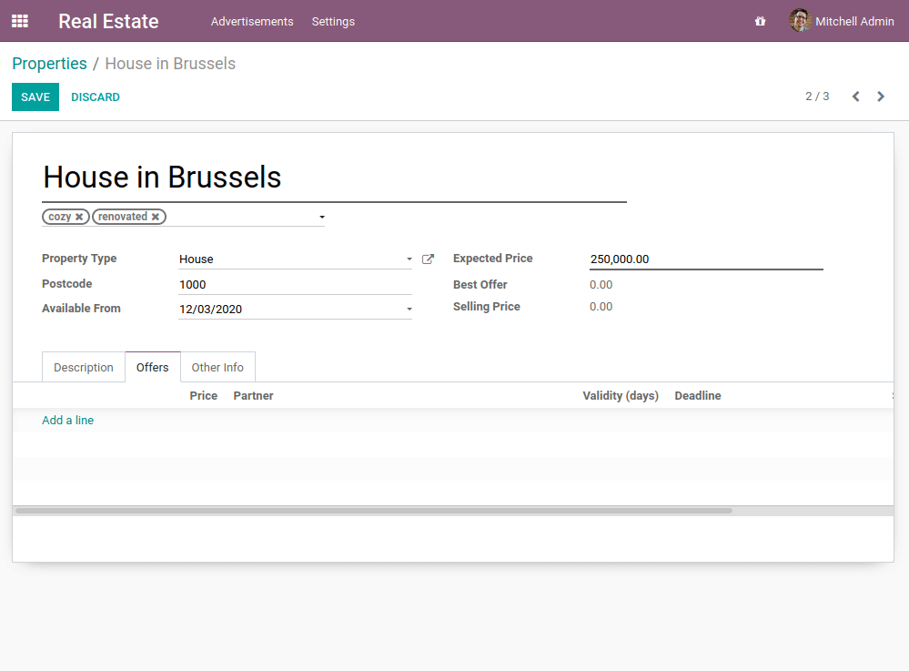
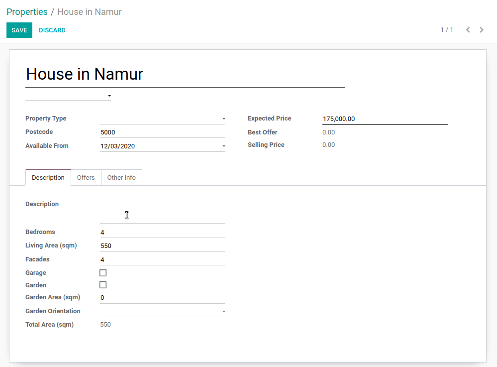

# Chapter 8: Computed Fields And Onchanges

The [relations between models](07_relations.md) are a key component of
any Odoo module. They are necessary for the modelization of any business case. However, we may want
links between the fields within a given model. Sometimes the value of one field is determined from
the values of other fields and other times we want to help the user with data entry.

These cases are supported by the concepts of computed fields and onchanges. Although this chapter is
not technically complex, the semantics of both concepts is very important.
This is also the first time we will write Python logic. Until now we haven't written anything
other than class definitions and field declarations.

## Computed Fields

**Reference**: the documentation related to this topic can be found in
[Computed Fields](../../reference/backend/orm/#reference-fields-compute).

#### NOTE
**Goal**: at the end of this section:

- In the property model, the total area and the best offer should be computed:


- In the property offer model, the validity date should be computed and can be updated:



In our real estate module, we have defined the living area as well as the garden area. It is then
natural to define the total area as the sum of both fields. We will use the concept of a computed
field for this, i.e. the value of a given field will be computed from the value of other fields.

So far fields have been stored directly in and retrieved directly from the
database. Fields can also be *computed*. In this case, the field's value is not
retrieved from the database but computed on-the-fly by calling a method of the
model.

To create a computed field, create a field and set its attribute
`compute` to the name of a method. The computation
method should set the value of the computed field for every record in
`self`.

By convention, `compute` methods are private, meaning that they cannot
be called from the presentation tier, only from the business tier (see
[Chapter 1: Architecture Overview](01_architecture.md#tutorials-server-framework-101-01-architecture)). Private methods have a name starting with an
underscore `_`.

### Dependencies

The value of a computed field usually depends on the values of other fields in
the computed record. The ORM expects the developer to specify those dependencies
on the compute method with the decorator `depends()`.
The given dependencies are used by the ORM to trigger the recomputation of the
field whenever some of its dependencies have been modified:

```default
from odoo import api, fields, models

class TestComputed(models.Model):
    _name = "test.computed"

    total = fields.Float(compute="_compute_total")
    amount = fields.Float()

    @api.depends("amount")
    def _compute_total(self):
        for record in self:
            record.total = 2.0 * record.amount
```

#### NOTE
`self` is a collection.

The object `self` is a *recordset*, i.e. an ordered collection of
records. It supports the standard Python operations on collections, e.g.
`len(self)` and `iter(self)`, plus extra set operations such as `recs1 |
recs2`.

Iterating over `self` gives the records one by one, where each record is
itself a collection of size 1. You can access/assign fields on single
records by using the dot notation, e.g. `record.name`.

Many examples of computed fields can be found in Odoo.
[Here](https://github.com/odoo/odoo/blob/713dd3777ca0ce9d121d5162a3d63de3237509f4/addons/account/models/account_move.py#L3420-L3423)
is a simple one.

For relational fields it's possible to use paths through a field as a dependency:

```default
description = fields.Char(compute="_compute_description")
partner_id = fields.Many2one("res.partner")

@api.depends("partner_id.name")
def _compute_description(self):
    for record in self:
        record.description = "Test for partner %s" % record.partner_id.name
```

The example is given with a `Many2one`, but it is valid for
`Many2many` or a `One2many`. An example can be found
[here](https://github.com/odoo/odoo/blob/713dd3777ca0ce9d121d5162a3d63de3237509f4/addons/account/models/account_reconcile_model.py#L248-L251).

Let's try it in our module with the following exercise!

### Inverse Function

You might have noticed that computed fields are read-only by default. This is expected since the
user is not supposed to set a value.

In some cases, it might be useful to still be able to set a value directly. In our real estate example,
we can define a validity duration for an offer and set a validity date. We would like to be able
to set either the duration or the date with one impacting the other.

To support this Odoo provides the ability to use an `inverse` function:

```default
from odoo import api, fields, models

class TestComputed(models.Model):
    _name = "test.computed"

    total = fields.Float(compute="_compute_total", inverse="_inverse_total")
    amount = fields.Float()

    @api.depends("amount")
    def _compute_total(self):
        for record in self:
            record.total = 2.0 * record.amount

    def _inverse_total(self):
        for record in self:
            record.amount = record.total / 2.0
```

An example can be found
[here](https://github.com/odoo/odoo/blob/2ccf0bd0dcb2e232ee894f07f24fdc26c51835f7/addons/crm/models/crm_lead.py#L308-L317).

A compute method sets the field while an inverse method sets the field's
dependencies.

Note that the `inverse` method is called when saving the record, while the
`compute` method is called at each change of its dependencies.

### Additional Information

Computed fields are **not stored** in the database by default. Therefore it is **not
possible** to search on a computed field unless a `search` method is defined. This topic is beyond the scope
of this training, so we won't cover it. An example can be found
[here](https://github.com/odoo/odoo/blob/f011c9aacf3a3010c436d4e4f408cd9ae265de1b/addons/event/models/event_event.py#L188).

Another solution is to store the field with the `store=True` attribute. While this is
usually convenient, pay attention to the potential computation load added to your model. Lets re-use
our example:

```default
description = fields.Char(compute="_compute_description", store=True)
partner_id = fields.Many2one("res.partner")

@api.depends("partner_id.name")
def _compute_description(self):
    for record in self:
        record.description = "Test for partner %s" % record.partner_id.name
```

Every time the partner `name` is changed, the `description` is automatically recomputed for
**all the records** referring to it! This can quickly become prohibitive to recompute when
millions of records need recomputation.

It is also worth noting that a computed field can depend on another computed field. The ORM is
smart enough to correctly recompute all the dependencies in the right order... but sometimes at the
cost of degraded performance.

In general performance must always be kept in mind when defining computed fields. The more
complex is your field to compute (e.g. with a lot of dependencies or when a computed field
depends on other computed fields), the more time it will take to compute. Always take some time to
evaluate the cost of a computed field beforehand. Most of the time it is only when your code
reaches a production server that you realize it slows down a whole process. Not cool :-(

## Onchanges

**Reference**: the documentation related to this topic can be found in
`onchange()`:

#### NOTE
**Goal**: at the end of this section, enabling the garden will set a default area of 10 and
an orientation to North.



In our real estate module, we also want to help the user with data entry. When the 'garden'
field is set, we want to give a default value for the garden area as well as the orientation.
Additionally, when the 'garden' field is unset we want the garden area to reset to zero and the
orientation to be removed. In this case, the value of a given field modifies the value of
other fields.

The 'onchange' mechanism provides a way for the client interface to update a
form without saving anything to the database whenever the user has filled in
a field value. To achieve this, we define a method where `self` represents
the record in the form view and decorate it with `onchange()`
to specify which field it is triggered by. Any change you make on
`self` will be reflected on the form:

```default
from odoo import api, fields, models

class TestOnchange(models.Model):
    _name = "test.onchange"

    name = fields.Char(string="Name")
    description = fields.Char(string="Description")
    partner_id = fields.Many2one("res.partner", string="Partner")

    @api.onchange("partner_id")
    def _onchange_partner_id(self):
        self.name = "Document for %s" % (self.partner_id.name)
        self.description = "Default description for %s" % (self.partner_id.name)
```

In this example, changing the partner will also change the name and the description values. It is up to
the user whether or not to change the name and description values afterwards. Also note that we do not
loop on `self`, this is because the method is only triggered in a form view, where `self` is always
a single record.

### Additional Information

Onchanges methods can also return a non-blocking warning message
([example](https://github.com/odoo/odoo/blob/cd9af815ba591935cda367d33a1d090f248dd18d/addons/payment_authorize/models/payment.py#L34-L36)).

## How to use them?

There is no strict rule for the use of computed fields and onchanges.

In many cases, both computed fields and onchanges may be used to achieve the same result. Always
prefer computed fields since they are also triggered outside of the context of a form view. Never
ever use an onchange to add business logic to your model. This is a **very bad** idea since
onchanges are not automatically triggered when creating a record programmatically; they are only
triggered in the form view.

The usual pitfall of computed fields and onchanges is trying to be 'too smart' by adding too much
logic. This can have the opposite result of what was expected: the end user is confused from
all the automation.

Computed fields tend to be easier to debug: such a field is set by a given method, so it's easy to
track when the value is set. Onchanges, on the other hand, may be confusing: it is very difficult to
know the extent of an onchange. Since several onchange methods may set the same fields, it
easily becomes difficult to track where a value is coming from.

When using stored computed fields, pay close attention to the dependencies. When computed fields
depend on other computed fields, changing a value can trigger a large number of recomputations.
This leads to poor performance.

In the [next chapter](09_actions.md), we'll see how we can trigger some
business logic when buttons are clicked.
