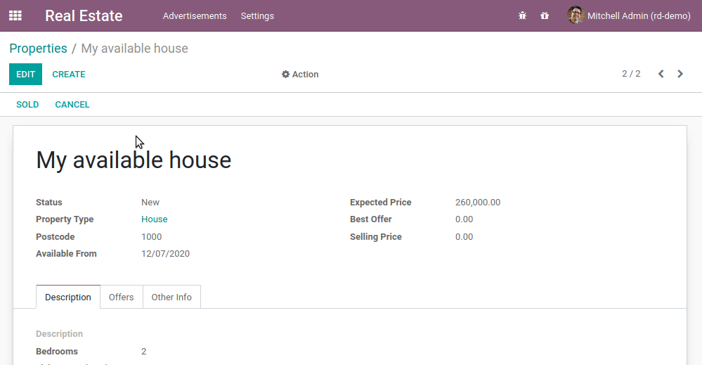
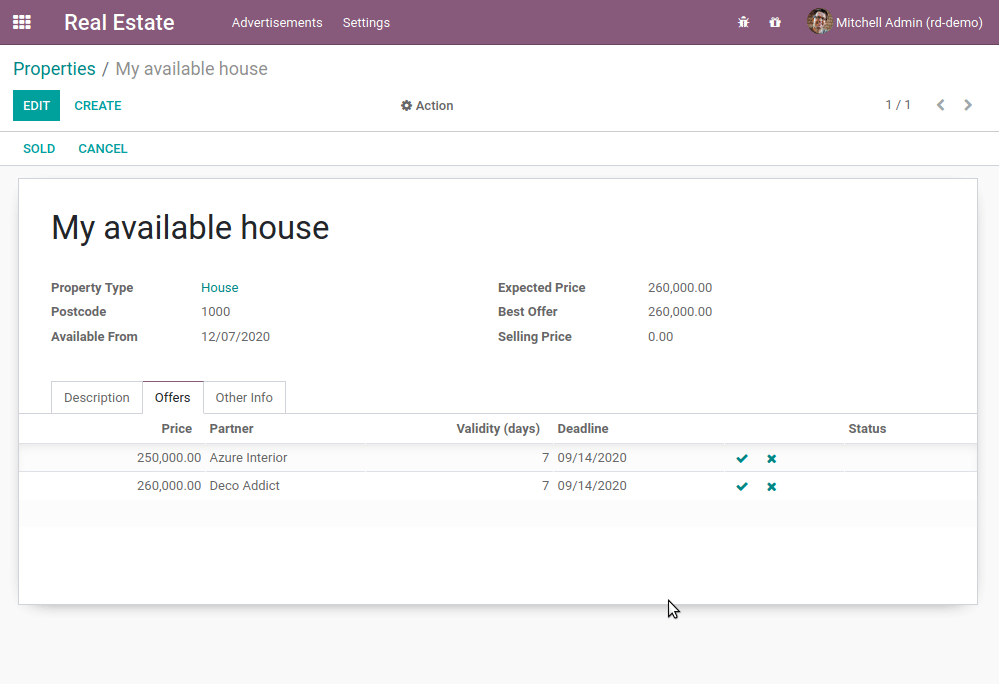
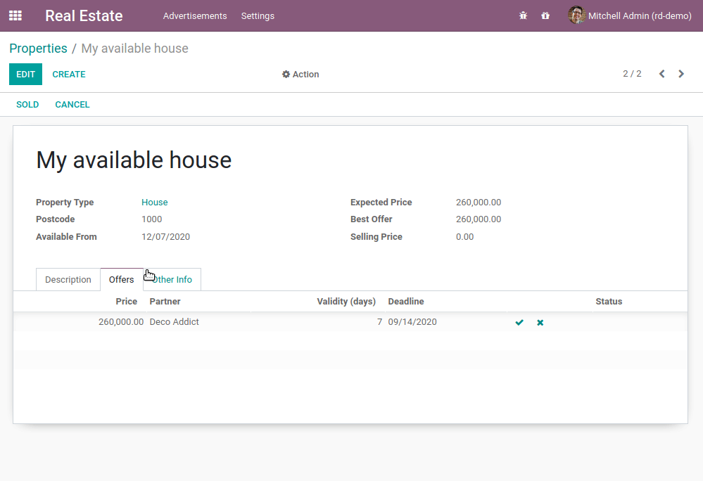

# Chapter 9: Ready For Some Action?

So far we have mostly built our module by declaring fields and views. We just introduced business
logic in the [previous chapter](developer/tutorials/server_framework_101/08_compute_onchange.md) thanks to
computed fields and onchanges. In any real business scenario, we would want to link some business
logic to action buttons. In our real estate example, we would like to be able to:

- cancel or set a property as sold
- accept or refuse an offer

One could argue that we can already do these things by changing the state manually, but
this is not really convenient. Moreover, we want to add some extra processing: when an offer is
accepted we want to set the selling price and the buyer for the property.

## Object Type

**Reference**: the documentation related to this topic can be found in
[Actions](developer/reference/backend/actions.md) and [Error management](developer/reference/backend/orm.md#reference-exceptions).

#### NOTE
**Goal**: at the end of this section:

- You should be able to cancel or set a property as sold:



A canceled property cannot be sold and a sold property cannot be canceled. For the sake of
clarity, the `state` field has been added on the view.

- You should be able to accept or refuse an offer:


- Once an offer is accepted, the selling price and the buyer should be set:



In our real estate module, we want to link business logic with some buttons. The most common way to
do this is to:

- Add a button in the view, for example in the `header` of the view:

```xml
<form>
    <header>
        <button name="action_do_something" type="object" string="Do Something"/>
    </header>
    <sheet>
        <field name="name"/>
    </sheet>
</form>
```

- and link this button to business logic:

```python
from odoo import fields, models

class TestAction(models.Model):
    _name = "test.action"

    name = fields.Char()

    def action_do_something(self):
        for record in self:
            record.name = "Something"
        return True
```

By assigning `type="object"` to our button, the Odoo framework will execute a Python method
with `name="action_do_something"` on the given model.

The first important detail to note is that our method name isn't prefixed with an underscore
(`_`). This makes our method a **public** method, which can be called directly from the Odoo
interface (through an RPC call). Until now, all methods we created (compute, onchange) were called
internally, so we used **private** methods prefixed by an underscore. You should always define your
methods as private unless they need to be called from the user interface.

Also note that we loop on `self`. Always assume that a method can be called on multiple records; it's
better for reusability.

Finally, a public method should always return something so that it can be called through XML-RPC.
When in doubt, just `return True`.

There are hundreds of examples in the Odoo source code. One example is this
[button in a view](https://github.com/odoo/odoo/blob/cd9af815ba591935cda367d33a1d090f248dd18d/addons/crm/views/crm_lead_views.xml#L9-L11)
and its
[corresponding Python method](https://github.com/odoo/odoo/blob/cd9af815ba591935cda367d33a1d090f248dd18d/addons/crm/models/crm_lead.py#L746-L760)

## Action Type

In [Chapter 5: Finally, Some UI To Play With](developer/tutorials/server_framework_101/05_firstui.md), we created an action that was linked to a menu. You
may be wondering if it is possible to link an action to a button. Good news, it is! One way to do it
is:

```xml
<button type="action" name="%(test.test_model_action)d" string="My Action"/>
```

We use `type="action"` and we refer to the [external identifier](developer/glossary.md#term-external-identifier) in the `name`.

In the [next chapter](developer/tutorials/server_framework_101/10_constraints.md) we'll see how we can prevent
encoding incorrect data in Odoo.
