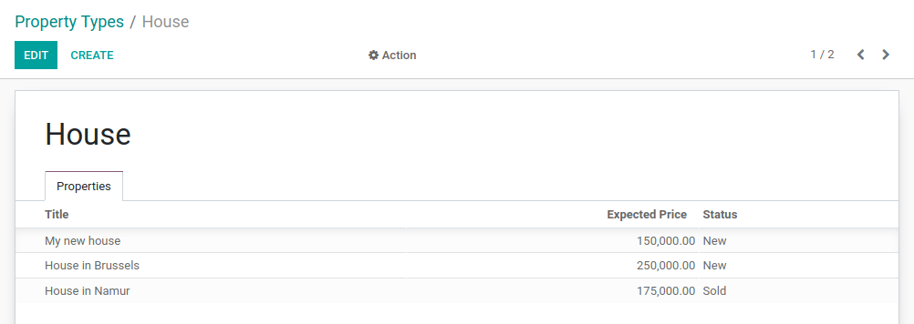
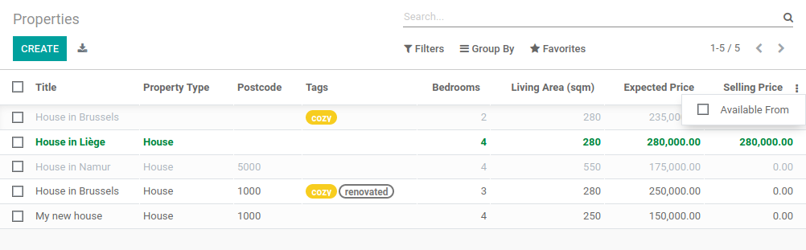
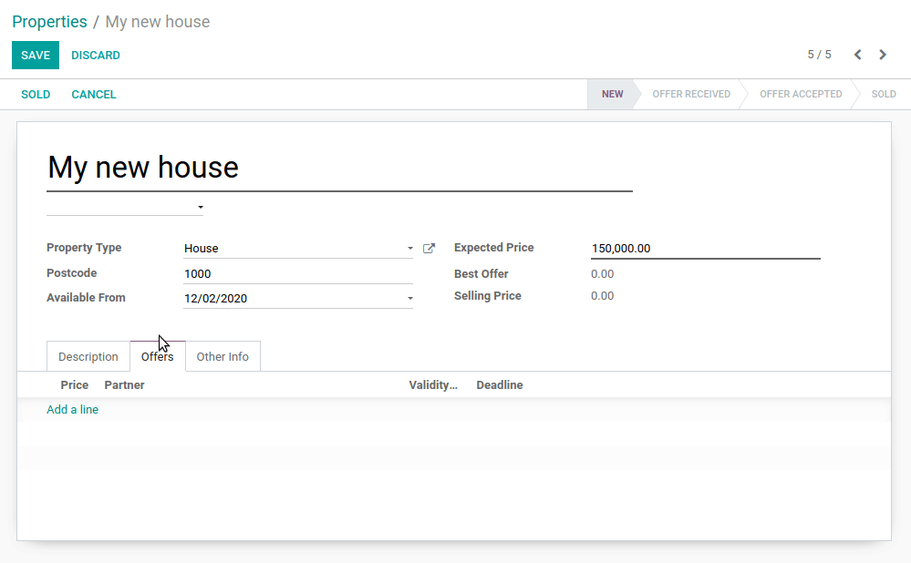
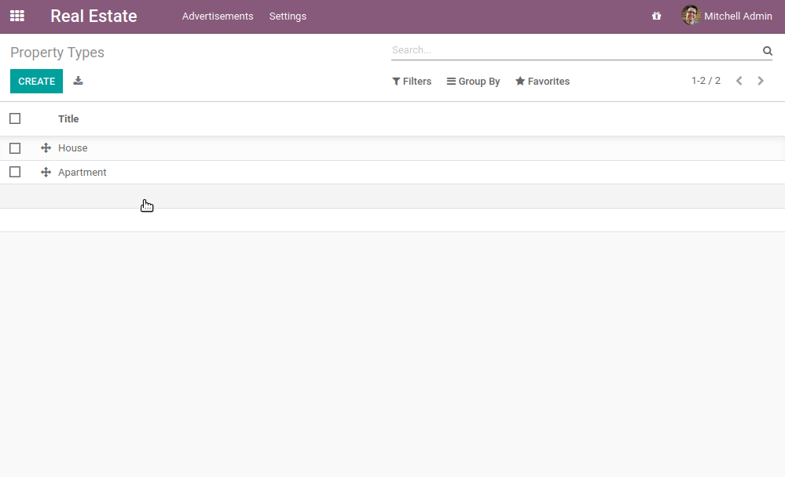

# Chapter 11: Add The Sprinkles

Our real estate module now makes sense from a business perspective. We created
[specific views](developer/tutorials/server_framework_101/06_basicviews.md), added several
[action buttons](developer/tutorials/server_framework_101/09_actions.md) and
[constraints](developer/tutorials/server_framework_101/10_constraints.md). However our user interface is still a bit
rough. We would like to add some colors to the list views and make some fields and buttons conditionally
disappear. For example, the 'Sold' and 'Cancel' buttons should disappear when the property
is sold or canceled since it is no longer allowed to change the state at this point.

This chapter covers a very small subset of what can be done in the views. Do not hesitate to
read the reference documentation for a more complete overview.

**Reference**: the documentation related to this chapter can be found in
[View records](developer/reference/user_interface/view_records.md) and
[View architectures](developer/reference/user_interface/view_architectures.md).

## Inline Views

#### NOTE
**Goal**: at the end of this section, a specific list of properties should be added to the property
type view:



In the real estate module we added a list of offers for a property. We simply added the field
`offer_ids` with:

```xml
<field name="offer_ids"/>
```

The field uses the specific view for `estate.property.offer`. In some cases we want to define
a specific list view which is only used in the context of a form view. For example, we would like
to display the list of properties linked to a property type. However, we only want to display 3
fields for clarity: name, expected price and state.

To do this, we can define *inline* list views. An inline list view is defined directly inside
a form view. For example:

```python
from odoo import fields, models

class TestModel(models.Model):
    _name = "test_model"
    _description = "Test Model"

    description = fields.Char()
    line_ids = fields.One2many("test_model_line", "model_id")


class TestModelLine(models.Model):
    _name = "test_model_line"
    _description = "Test Model Line"

    model_id = fields.Many2one("test_model")
    field_1 = fields.Char()
    field_2 = fields.Char()
    field_3 = fields.Char()
```

```xml
<form>
    <field name="description"/>
    <field name="line_ids">
        <tree>
            <field name="field_1"/>
            <field name="field_2"/>
        </tree>
    </field>
</form>
```

In the form view of the `test_model`, we define a specific list view for `test_model_line`
with fields `field_1` and `field_2`.

An example can be found
[here](https://github.com/odoo/odoo/blob/0e12fa135882cd5095dbf15fe2f64231c6a84336/addons/event/views/event_tag_views.xml#L27-L33).

## Widgets

**Reference**: the documentation related to this section can be found in
[Fields](developer/reference/frontend/javascript_reference.md#reference-js-widgets).

#### NOTE
**Goal**: at the end of this section, the state of the property should be displayed using a
specific widget:


Four states are displayed: New, Offer Received, Offer Accepted and Sold.

Whenever we've added fields to our models, we've (almost) never had to worry about how
these fields would look like in the user interface. For example, a date picker is provided
for a `Date` field and a `One2many` field is automatically displayed as a list. Odoo
chooses the right 'widget' depending on the field type.

However, in some cases, we want a specific representation of a field which can be done thanks to
the `widget` attribute. We already used it for the `tag_ids` field when we used the
`widget="many2many_tags"` attribute. If we hadn't used it, then the field would have displayed as a
list.

Each field type has a set of widgets which can be used to fine tune its display. Some widgets also
take extra options. An exhaustive list can be found in [Fields](developer/reference/frontend/javascript_reference.md#reference-js-widgets).

#### WARNING
Same field multiple times in a view

Add a field only **once** to a list or a form view. Adding it multiple times is
not supported.

## List Order

**Reference**: the documentation related to this section can be found in
[Models](developer/reference/backend/orm.md#reference-orm-models).

#### NOTE
**Goal**: at the end of this section, all lists should display by default in a deterministic
order. Property types can be ordered manually.

During the previous exercises, we created several list views. However, at no point did we specify
which order the records had to be listed in by default. This is a very important thing for many business
cases. For example, in our real estate module we would want to display the highest offers on top of the
list.

### Model

Odoo provides several ways to set a default order. The most common way is to define
the `_order` attribute directly in the model. This way, the retrieved records will follow
a deterministic order which will be consistent in all views including when records are searched
programmatically. By default there is no order specified, therefore the records will be
retrieved in a non-deterministic order depending on PostgreSQL.

The `_order` attribute takes a string containing a list of fields which will be used for sorting.
It will be converted to an [order_by](https://www.postgresql.org/docs/12/queries-order.html) clause in SQL. For example:

```python
from odoo import fields, models

class TestModel(models.Model):
    _name = "test_model"
    _description = "Test Model"
    _order = "id desc"

    description = fields.Char()
```

Our records are ordered by descending `id`, meaning the highest comes first.

### View

Ordering is possible at the model level. This has the advantage of a consistent order everywhere
a list of records is retrieved. However, it is also possible to define a specific order directly
in a view thanks to the `default_order` attribute
([example](https://github.com/odoo/odoo/blob/892dd6860733c46caf379fd36f57219082331b66/addons/crm/report/crm_activity_report_views.xml#L30)).

### Manual

Both model and view ordering allow flexibility when sorting records, but there is still one case
we need to cover: the manual ordering. A user may want to sort records depending on the business
logic. For example, in our real estate module we would like to sort the property types manually.
It is indeed useful to have the most used types appear at the top of the list. If our real estate
agency mainly sells houses, it is more convenient to have 'House' appear before 'Apartment'.

To do so, a `sequence` field is used in combination with the `handle` widget. Obviously
the `sequence` field must be the first field in the `_order` attribute.

## Attributes and options

It would be prohibitive to detail all the available features which allow fine tuning of the look of a
view. Therefore, we'll stick to the most common ones.

### Form

#### NOTE
**Goal**: at the end of this section, the property form view will have:

- Conditional display of buttons and fields
- Tag colors


In our real estate module, we want to modify the behavior of some fields. For example, we don't
want to be able to create or edit a property type from the form view. Instead we expect the
types to be handled in their appropriate menu. We also want to give tags a color. In order to add these
behavior customizations, we can add the `options` attribute to several field widgets.

In [Chapter 5: Finally, Some UI To Play With](developer/tutorials/server_framework_101/05_firstui.md), we saw that reserved fields were used for
specific behaviors. For example, the `active` field is used to automatically filter out
inactive records. We added the `state` as a reserved field as well. It's now time to use it!
A `state` field can be used in combination with an `invisible` attribute in the view to display
buttons conditionally.

More generally, it is possible to make a field `invisible`, `readonly` or `required` based
on the value of other fields. Note that `invisible` can also be applied to other elements of
the view such as `button` or `group`.

`invisible`, `readonly` and `required` can have any Python expression as value. The expression
gives the condition in which the property applies. For example:

```xml
<form>
    <field name="description" invisible="not is_partner"/>
    <field name="is_partner" invisible="True"/>
</form>
```

This means that the `description` field is invisible when `is_partner` is `False`. It is
important to note that a field used in `invisible` **must** be present in the view. If it
should not be displayed to the user, we can use the `invisible` attribute to hide it.

#### WARNING
Using a (conditional) `readonly` attribute in the view can be useful to prevent data entry
errors, but keep in mind that it doesn't provide any level of security! There is no check done
server-side, therefore it's always possible to write on the field through a RPC call.

### List

#### NOTE
**Goal**: at the end of this section, the property and offer list views should have color decorations.
Additionally, offers and tags will be editable directly in the list, and the availability date will be
hidden by default.



When the model only has a few fields, it can be useful to edit records directly through the list
view and not have to open the form view. In the real estate example, there is no need to open a form view
to add an offer or create a new tag. This can be achieved thanks to the `editable` attribute.

On the other hand, when a model has a lot of fields it can be tempting to add too many fields in the
list view and make it unclear. An alternative method is to add the fields, but make them optionally
hidden. This can be achieved thanks to the `optional` attribute.

Finally, color codes are useful to visually emphasize records. For example, in the real estate
module we would like to display refused offers in red and accepted offers in green. This can be achieved
thanks to the `decoration-{$name}` attribute (see [Fields](developer/reference/frontend/javascript_reference.md#reference-js-widgets) for a
complete list):

```xml
<tree decoration-success="is_partner==True">
    <field name="name"/>
    <field name="is_partner" invisible="1"/>
</tree>
```

The records where `is_partner` is `True` will be displayed in green.

### Search

**Reference**: the documentation related to this section can be found in
[Search](developer/reference/user_interface/view_architectures.md#reference-view-architectures-search) and [Search defaults](developer/reference/user_interface/view_architectures.md#reference-view-architectures-search-defaults).

#### NOTE
**Goal**: at the end of this section, the available properties will be filtered by default,
and searching on the living area returns results where the area is larger than the given
number.


Last but not least, there are some tweaks we would like to apply when searching. First of all, we
want to have our 'Available' filter applied by default when we access the properties. To make this happen, we
need to use the `search_default_{$name}` action context, where `{$name}` is the filter name.
This means that we can define which filter(s) will be activated by default at the action level.

Here is an example of an
[action](https://github.com/odoo/odoo/blob/6decc32a889b46947db6dd4d42ef995935894a2a/addons/crm/report/crm_opportunity_report_views.xml#L115)
with its
[corresponding filter](https://github.com/odoo/odoo/blob/6decc32a889b46947db6dd4d42ef995935894a2a/addons/crm/report/crm_opportunity_report_views.xml#L68).

Another useful improvement in our module would be the ability to search efficiently by living area.
In practice, a user will want to search for properties of 'at least' the given area. It is unrealistic
to expect users would want to find a property of an exact living area. It is always
possible to make a custom search, but that's inconvenient.

Search view `<field>` elements can have a `filter_domain` that overrides
the domain generated for searching on the given field. In the given domain,
`self` represents the value entered by the user. In the example below, it is
used to search on both `name` and `description` fields.

```xml
<search string="Test">
    <field name="description" string="Name and description"
           filter_domain="['|', ('name', 'ilike', self), ('description', 'ilike', self)]"/>
</search>
```

## Stat Buttons

#### NOTE
**Goal**: at the end of this section, there will be a stat button on the property type form view
which shows the list of all offers related to properties of the given type when it is clicked on.



If you've already used some functional modules in Odoo, you've probably already encountered a 'stat
button'. These buttons are displayed on the top right of a form view and give a quick access to
linked documents. In our real estate module, we would like to have a quick link to the offers
related to a given property type as depicted in the **Goal** of this section.

At this point of the tutorial we have already seen most of the concepts to do this. However,
there is not a single solution and it can still be confusing if you don't know where to start from.
We'll describe a step-by-step solution in the exercise. It can always be useful to find some
examples in the Odoo codebase by looking for `oe_stat_button`.

The following exercise might be a bit more difficult than the previous ones since it assumes you
are able to search for examples in the source code on your own. If you are stuck there is probably
someone nearby who can help you ;-)

The exercise introduces the concept of [Related fields](developer/reference/backend/orm.md#reference-fields-related). The easiest way to
understand it is to consider it as a specific case of a computed field. The following definition
of the `description` field:

```python
...

partner_id = fields.Many2one("res.partner", string="Partner")
description = fields.Char(related="partner_id.name")
```

is equivalent to:

```python
...

partner_id = fields.Many2one("res.partner", string="Partner")
description = fields.Char(compute="_compute_description")

@api.depends("partner_id.name")
def _compute_description(self):
    for record in self:
        record.description = record.partner_id.name
```

Every time the partner name is changed, the description is modified.

Looking good? If not, don't worry, the [next chapter](developer/tutorials/server_framework_101/12_inheritance.md) doesn't require stat buttons ;-)
